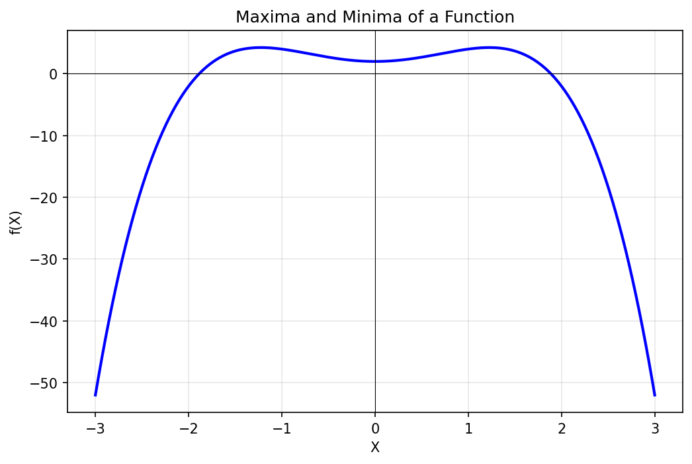

# Unit I: Optimization & ML Fundamentals - Comprehensive Exam Notes

---

## 1. Maxima and Minima
*   **Stationary Points**: These occur where the **first derivative** is zero ($\frac{df}{dx} = 0$). They represent points where the function is temporarily "flat".
*   **The Second Derivative Test**: This is how we distinguish between different types of stationary points:
    *   **Local Minimum**: Occurs if $f''(x) > 0$. The function is "concave up" (like a bowl), and the slope is increasing.
    *   **Local Maximum**: Occurs if $f''(x) < 0$. The function is "concave down" (like a cap), and the slope is decreasing.
    *   **Saddle Point**: Occurs if $f''(x) = 0$ and the sign doesn't change on either side (neither a max nor a min).

### Detailed Description
Maxima and Minima refer to the peak values and bottom-most values that a mathematical function can take. In the context of optimization, we are usually searching for the **Minimum**, which represents the lowest possible error our model can make. To find these points, we look for "stationary points" where the slope of the curve becomes zero, meaning you are no longer going up or down.

### Practical Example
Imagine you are managing a logistics company. You have a mathematical formula that calculates your total delivery cost based on the number of trucks you use. The **Minimum** point of that function tells you the exact number of trucks that will result in the lowest possible fuel and labor costs, preventing you from over-spending or under-delivering.

---

## 2. Vector Calculus - Gradient (Grad)
*   **The Del Operator ($\nabla$)**: Represents the vector of **partial derivatives**. If $f$ depends on $x, y, z$, then $\nabla f = [\frac{\partial f}{\partial x}, \frac{\partial f}{\partial y}, \frac{\partial f}{\partial z}]^T$.
*   **Physical Interpretation**: The gradient points in the direction of the **steepest ascent**. Its magnitude indicates how quickly the function is rising.
*   **Key Property**: The gradient is always **perpendicular (orthogonal)** to the level curves (contours) of the function.

### Detailed Description
The Gradient is a multi-dimensional generalization of the derivative. While a simple derivative tells you the slope on a 2D line, the Gradient acts as a "compass" in a 3D or high-dimensional landscape. At any given point on a surface, the gradient vector points exactly toward the direction that would make you climb the steepest. In Machine Learning, we calculate the gradient of the "Error" with respect to our "Weights" to know how to adjust the model.

### Practical Example
Suppose you are standing on a complex mountain range and want to reach the highest peak as quickly as possible. The **Gradient** is the mathematical equivalent of looking 360 degrees around you and identifying the exact path that has the steepest incline. If you follow this "arrow" at every step, you will climb the mountain using the shortest possible distance.

---

## 3. Gradient Descent (GD) - Geometric Intuition
*   **Iterative Algorithm**: Since we cannot solve $\nabla f = 0$ directly for complex neural networks, we use an iterative approach.
*   **Step**: Update weights as $w_{new} = w_{old} - \alpha \times \text{slope}$.
*   **Convexity**: If a function is **Convex**, GD is guaranteed to find the global minimum.

### Detailed Description
Gradient Descent is the most fundamental optimization algorithm in Artificial Intelligence. It is a strategy for finding the minimum of a function by taking repeated small steps in the direction that goes "downhill." Because we cannot jump straight to the answer in a complex model (like a neural network), we must "walk" toward it. The "geometric intuition" refers to the idea that we are effectively rolling a ball down a bowl until it settles at the very bottom.

### Practical Example
Think of yourself being dropped at a random location on a foggy mountain in the middle of the night. You cannot see the valley (the minimum), but you can feel the slope of the ground under your feet. Using **Gradient Descent**, you would simply step in whichever direction feels "downhill." If you keep doing this every few seconds, you will eventually reach the lowest point in the valley, even without being able to see it.

---

## 4. Learning Rate ($\alpha$)
*   **The Role**: It is a scalar that controls the **velocity** of the descent.
*   **Scenario Analysis**:
    *   **Low $\alpha$**: Training is stable but takes thousands of hours (slow).
    *   **High $\alpha$**: The algorithm "overshoots" the minimum, possibly causing the loss to **diverge**.

### Detailed Description
The Learning Rate is a "speed controller" for the Gradient Descent algorithm. It determines how big of a step the model takes during each update. If the step is too small, you will move toward the goal so slowly that the training will never finish. If the step is too large, you might accidentally step right over the goal and start moving away from it. Finding the perfect "Goldilocks" learning rate is the key to training successful AI models.

### Practical Example
Imagine you are 10 meters away from a target hole and you want to step into it. If your "Learning Rate" (step size) is only 1 centimeter, it will take you 1,000 steps to get there, which is extremely inefficient. However, if your "Learning Rate" is 11 meters, you will jump right over the hole and end up on the other side. You will then turn around and jump 11 meters back, missing the hole again and again (**Oscillation**).

---

## 5. Gradient Descent for Linear Regression
*   **Goal**: Find the weights $w$ and bias $b$ that minimize the **Mean Squared Error (MSE)**.
*   **Loss Function**: $J(w, b) = \frac{1}{n} \sum (\text{Actual} - \text{Predicted})^2$.
*   **Stability**: Because the MSE loss for linear regression is a **paraboloid (convex)**, Gradient Descent will always eventually converge to the single best solution.

### Detailed Description
In Linear Regression, we are trying to predict a numerical value (like a house price) based on input data. We use Gradient Descent to tune the "slope" and "intercept" of a line so that it passes as close as possible to all the data points on a graph. This is a very special case because the mathematical landscape of the error is a perfectly smooth "bowl" (convex), meaning there are no traps or dead ends—the algorithm is mathematically guaranteed to work perfectly.

### Practical Example
Suppose you have a chart showing how study hours lead to better exam scores. The data points are a bit messy and scattered. By applying **Gradient Descent for Linear Regression**, you are mathematically dragging and rotating a line across the chart until it perfectly balances between all the points, allowing you to accurately predict that "If a student studies for 5 hours, they will likely score an 85%."

---

## 6. Stochastic Gradient Descent (SGD) Algorithm
*   **The SGD Logic**: Use **one single random instance** to calculate the gradient and update immediately.
*   **Pros**:
    *   **Speed**: Updates weights much more frequently.
    *   **Escape**: The noisy path helps "jump" out of poor local minima.

### Detailed Description
Standard Gradient Descent is "slow" because it waits to look at all 1,000,000 images in a dataset before taking just one single step. Stochastic Gradient Descent (SGD) is the "high-speed" version. It looks at just one single random image, takes a step immediately, and moves on to the next one. While it might take a "noisy" or zig-zag path, it is incredibly efficient for large data and is the standard way nearly all modern AI (like ChatGPT or Self-Driving cars) is trained.

### Practical Example
Imagine a chef trying to perfect the saltiness of a 100-gallon pot of soup. A "Batch" chef would drink the entire 100 gallons before deciding to add salt. An **SGD** chef would take just one small spoonful (a single sample), realize it's bland, add salt immediately, and then take another spoonful to check again. The SGD chef finishes the task 1,000 times faster.

---

## 7. Constrained Optimization & PCA
*   **Constrained Optimization**: Optimizing $f(x)$ while staying within "forbidden zones" (e.g., $x^2 + y^2 = 1$).
*   **Principal Component Analysis (PCA)**:
    1.  **Center the data**: Subtract the mean.
    2.  **Covariance Matrix**: Find correlations.
    3.  **Eigendecomposition**: Find axes of maximum variance.

### Detailed Description
**Constrained Optimization** is about finding the best solution when you have strict rules or limits you must follow (e.g., you want the fastest car, but it cannot weigh more than 500kg). **PCA (Principal Component Analysis)** is a tool for "simplification." It identifies the most important patterns in a massive amount of data and ignores the "noise," allowing us to turn a complex 1,000-variable dataset into a much simpler 5-variable version without losing the "big picture."

### Practical Example
Think of a detailed 3D sculpture. If you want to take a photo of it (which is 2D), **PCA** is the process of rotating that sculpture to the exact angle where the 2D shadow captures the most detail possible. You are reducing "3D" to "2D," but you are doing it in a way that keeps the most "information" about the sculpture's shape.

---

## 8. Logistic Regression Formulation Revisited
*   **Classification**: Used when the output is a **probability** (0 or 1).
*   **The Sigmoid Link**: Pass the sum through $\sigma(z) = \frac{1}{1 + e^{-z}}$.

### Detailed Description
Logistic Regression is the foundation of classification in Machine Learning. Unlike Linear Regression (which predicts a continuous number), Logistic Regression predicts a "probability." It uses a special mathematical "S-curve" called the Sigmoid function to squash any input value into a range between 0 and 1. This is the starting point for modern "Deep Learning" neurons.

### Practical Example
A bank needs to decide if a credit card transaction is "Fraud" or "Not Fraud." The model looks at the transaction amount and location and calculates a probability. If the **Logistic Regression** model outputs a 0.92, it means there is a 92% chance the transaction is fraudulent, and the bank will automatically block the card.

---
**End of Unit I Comprehensive Notes**
