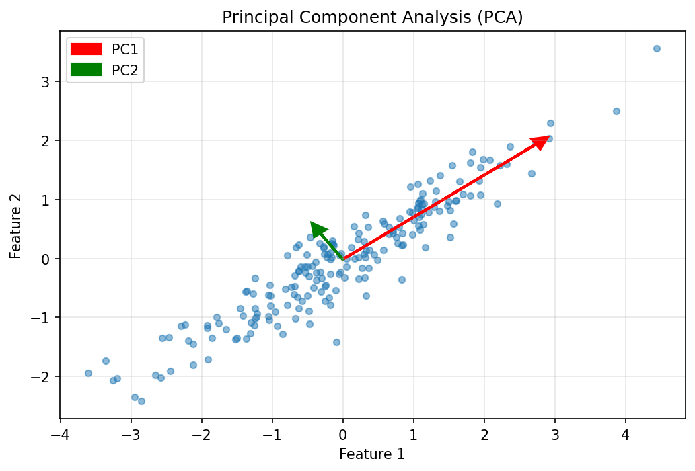

# Unit I: Optimization and Machine Learning Fundamentals

---

## Topic: Maxima and Minima

### Definition
- **Maxima**: Highest value a function achieves at a point
- **Minima**: Lowest value a function achieves at a point
- At both maxima and minima, slope (derivative) equals zero: $\frac{df}{dx} = 0$

### Key Concepts
- **Local Maximum**: Maximum within neighborhood, not globally highest
- **Global Maximum**: Maximum of all local maxima
- **Local Minimum**: Minimum within neighborhood, not globally lowest
- **Global Minimum**: Minimum of all local minima
- Slope changes sign: positive → zero → negative around minima
- Functions may have no maxima, no minima, or multiple of each
- Example: $f(x) = x^2$ has minimum at $x=0$, no maximum
- Example: $f(x) = -x^2$ has maximum at $x=0$, no minimum

### Key Formula
**Necessary Condition for Extrema:**
$$\frac{df}{dx} = 0$$

**Finding Extrema:**
- Differentiate function w.r.t. variable
- Set derivative equal to zero
- Solve for critical points

### Exam Points
**Properties:**
- Slope = 0 at extrema
- Second derivative test: $f''(x) > 0$ → minima, $f''(x) < 0$ → maxima

**Limitations:**
- Solving $\frac{df}{dx} = 0$ difficult for complex functions (e.g., $f(x) = \log(1 + e^{ax})$)
- Requires iterative computational techniques

**Applications:**
- Optimization problems in ML
- Cost function minimization
- Parameter estimation

**Source:** Video "MAXIMA AND MINIMA LEC 360" (0:00-14:25)

***

## Topic: Vector Calculus - Gradient (Grad)

### Definition
- **Gradient**: Vector of partial derivatives when $x$ is a vector
- Notation: $\nabla f$ or $\frac{\partial f}{\partial \mathbf{x}}$ (Del operator)
- Extends scalar differentiation to vector spaces

### Key Concepts
- If $\mathbf{x} = [x_1, x_2, \dots, x_d]^T$ is d-dimensional vector
- Gradient is also d-dimensional: $\nabla f \in \mathbb{R}^d$
- **Partial Differentiation**: Differentiate w.r.t. one variable, treat others as constants
- Symbol $\partial$ (del) indicates vector differentiation
- Result is vector of all partial derivatives
- Used when $f(\mathbf{x})$ is scalar function of vector $\mathbf{x}$

### Key Formula
**Gradient Definition:**
$$\nabla f = \frac{\partial f}{\partial \mathbf{x}} = \begin{bmatrix} \frac{\partial f}{\partial x_1} \\ \frac{\partial f}{\partial x_2} \\ \vdots \\ \frac{\partial f}{\partial x_d} \end{bmatrix}$$

**Example:** If $f(\mathbf{x}) = \mathbf{a}^T\mathbf{x} = \sum_{i=1}^d a_i x_i$

Then: $\nabla f = \mathbf{a}$

**Logistic Loss Gradient:**
$$L(\mathbf{w}) = \sum_{i=1}^n \log(1 + e^{-y_i \mathbf{w}^T\mathbf{x}_i}) + \lambda \mathbf{w}^T\mathbf{w}$$

$$\nabla_{\mathbf{w}} L = \sum_{i=1}^n \frac{-y_i \mathbf{x}_i e^{-y_i \mathbf{w}^T\mathbf{x}_i}}{1 + e^{-y_i \mathbf{w}^T\mathbf{x}_i}} + 2\lambda \mathbf{w}$$

### Exam Points
**Properties:**
- Gradient points in direction of steepest ascent
- Negative gradient points toward steepest descent
- Magnitude indicates rate of change

**Advantages:**
- Enables high-dimensional optimization
- Foundation for gradient descent
- Generalizes scalar calculus

**Applications:**
- Machine learning optimization
- Neural network backpropagation
- Vector field analysis

**Source:** Video "VECTOR CALCULUS GRAD LEC 361" (0:00-21:36)

***

## Topic: Gradient Descent - Geometric Intuition

### Definition
- **Iterative algorithm** to find minima when solving $\nabla f = 0$ is difficult
- Easy to implement on modern computers
- Moves from initial guess toward optimal solution

### Key Concepts
- **Initial Guess**: Start with random $x_0$
- **Iterations**: $x_0 \rightarrow x_1 \rightarrow x_2 \rightarrow \dots \rightarrow x_k \rightarrow x^*$
- Each iteration moves closer to optimal $x^*$
- **Slope Behavior**: On left of minimum (positive slope), on right (negative slope), at minimum (zero slope)
- As moving toward minimum, slope magnitude decreases
- **Key Observation**: Slope changes sign from positive to negative at minima

### Key Formula
**Optimization Problem:**
$$x^* = \arg\min_x f(x)$$

**Minimization ↔ Maximization:**
$$\min f(x) = \max(-f(x))$$
$$\max f(x) = \min(-f(x))$$

**Slope Analysis:**
- Left side: $0^\circ < \theta < 90^\circ$ → $\tan\theta > 0$ (positive slope)
- At minimum: $\theta = 0^\circ$ → $\tan\theta = 0$ (zero slope)
- Right side: $90^\circ < \theta < 180^\circ$ → $\tan\theta < 0$ (negative slope)

### Exam Points
**Properties:**
- Slope sign indicates direction to move
- Slope magnitude indicates distance from optimum
- Works when analytical solution unavailable

**Advantages:**
- Computationally efficient
- Handles complex functions
- Generalizes to high dimensions

**Disadvantages:**
- May converge to local minima
- Requires careful initialization
- Convergence speed varies

**Source:** Video "GRADIENT DESCENT ALGORITHM GEOMETRIC Intuition LEC 362" (0:00-13:20)

***

## Topic: Learning Rate

### Definition
- **Step size** parameter controlling how much to move in gradient direction
- Denoted by $\alpha$ or $\eta$ (eta)
- Critical hyperparameter affecting convergence

### Key Concepts
- **Small Learning Rate**: Slow convergence, stable, many iterations needed
- **Large Learning Rate**: Fast initial progress, may overshoot, oscillation risk
- **Optimal Learning Rate**: Balance between speed and stability
- Too small → computational inefficiency
- Too large → divergence, no convergence
- Adaptive learning rates adjust during training

### Key Formula
**Gradient Descent Update Rule:**
$$x_{k+1} = x_k - \alpha \nabla f(x_k)$$

Where:
- $x_k$ = current parameter value
- $\alpha$ = learning rate
- $\nabla f(x_k)$ = gradient at $x_k$
- $x_{k+1}$ = updated parameter value

### Exam Points
**Properties:**
- Scalar value $\alpha > 0$
- Constant or adaptive
- Problem-dependent optimal value

**Selection Strategies:**
- Grid search
- Exponential decay: $\alpha_t = \alpha_0 e^{-kt}$
- Learning rate schedules
- Adaptive methods (Adam, RMSprop)

**Impact on Training:**
- Affects convergence speed
- Determines optimization quality
- Influences final accuracy

**Source:** Derived from LEC 362-363 concepts

***

## Topic: Gradient Descent for Linear Regression

### Definition
- Apply gradient descent to minimize **Mean Squared Error (MSE)** loss
- Find optimal weights $\mathbf{w}^*$ for linear model
- Iterative approach for parameter estimation

### Key Concepts
- **Linear Model**: $\hat{y} = \mathbf{w}^T\mathbf{x} + b$
- **Cost Function**: $J(\mathbf{w}) = \frac{1}{2n}\sum_{i=1}^n (y_i - \mathbf{w}^T\mathbf{x}_i)^2$
- Convex cost function → single global minimum
- Gradient descent guaranteed to find optimal solution
- Update rule applied to all parameters simultaneously

### Key Formula
**Cost Function (MSE):**
$$J(\mathbf{w}) = \frac{1}{2n}\sum_{i=1}^n (y_i - \mathbf{w}^T\mathbf{x}_i)^2$$

**Gradient of Cost:**
$$\nabla_{\mathbf{w}} J = -\frac{1}{n}\sum_{i=1}^n (y_i - \mathbf{w}^T\mathbf{x}_i)\mathbf{x}_i$$

**Update Rule:**
$$\mathbf{w}_{k+1} = \mathbf{w}_k - \alpha \nabla_{\mathbf{w}} J(\mathbf{w}_k)$$

$$\mathbf{w}_{k+1} = \mathbf{w}_k + \frac{\alpha}{n}\sum_{i=1}^n (y_i - \mathbf{w}^T\mathbf{x}_i)\mathbf{x}_i$$

### Exam Points
**Algorithm Steps:**
1. Initialize weights randomly: $\mathbf{w}_0$
2. Compute predictions: $\hat{y}_i = \mathbf{w}^T\mathbf{x}_i$
3. Calculate gradient: $\nabla J$
4. Update weights: $\mathbf{w} \leftarrow \mathbf{w} - \alpha \nabla J$
5. Repeat until convergence

**Convergence Criteria:**
- $|\nabla J| < \epsilon$
- $|J_{k+1} - J_k| < \epsilon$
- Maximum iterations reached

**Applications:**
- Predictive modeling
- Trend analysis
- Feature relationship discovery

**Source:** Applied from vector calculus concepts in LEC 361

***

## Topic: Stochastic Gradient Descent (SGD)

### Definition
- **Update weights using one sample at a time** instead of entire dataset
- Faster iterations, more frequent updates
- Introduces stochasticity in optimization path

### Key Concepts
- **Batch GD**: Uses all $n$ samples per update
- **SGD**: Uses 1 sample per update
- **Mini-batch GD**: Uses batch of $b$ samples ($1 < b < n$)
- Noisy updates help escape local minima
- Requires more epochs but faster per epoch
- Online learning capable

### Key Formula
**Batch Gradient Descent:**
$$\mathbf{w}_{k+1} = \mathbf{w}_k - \alpha \frac{1}{n}\sum_{i=1}^n \nabla f_i(\mathbf{w}_k)$$

**Stochastic Gradient Descent:**
$$\mathbf{w}_{k+1} = \mathbf{w}_k - \alpha \nabla f_i(\mathbf{w}_k)$$

Where $i$ is randomly selected from $\{1, 2, \dots, n\}$

**Mini-batch GD:**
$$\mathbf{w}_{k+1} = \mathbf{w}_k - \alpha \frac{1}{b}\sum_{i \in \mathcal{B}} \nabla f_i(\mathbf{w}_k)$$

Where $\mathcal{B}$ is random batch of size $b$

### Exam Points
**Comparison:**
| Feature | Batch GD | SGD | Mini-batch |
|---------|----------|-----|------------|
| Samples/update | $n$ | 1 | $b$ |
| Convergence | Smooth | Noisy | Moderate |
| Speed | Slow | Fast | Balanced |
| Memory | High | Low | Medium |

**Advantages:**
- Computationally efficient for large datasets
- Can escape local minima
- Enables online learning

**Disadvantages:**
- Noisy convergence path
- May not reach exact minimum
- Requires learning rate tuning

**Source:** Extension of gradient descent concepts from LEC 362-363

***

## Topic: Constrained Optimization

### Definition
- Optimization with **constraints** on variables
- Find optimal solution satisfying constraint conditions
- Uses Lagrange multipliers method

### Key Concepts
- **Objective Function**: $f(\mathbf{x})$ to minimize/maximize
- **Equality Constraints**: $g_i(\mathbf{x}) = 0$
- **Inequality Constraints**: $h_j(\mathbf{x}) \leq 0$
- **Feasible Region**: Set of points satisfying all constraints
- Optimal point may lie on constraint boundary
- KKT conditions for inequality constraints

### Key Formula
**Lagrangian Function:**
$$\mathcal{L}(\mathbf{x}, \boldsymbol{\lambda}) = f(\mathbf{x}) + \sum_{i=1}^m \lambda_i g_i(\mathbf{x})$$

Where:
- $f(\mathbf{x})$ = objective function
- $g_i(\mathbf{x}) = 0$ = equality constraints
- $\lambda_i$ = Lagrange multipliers

**Optimality Conditions:**
$$\nabla_{\mathbf{x}} \mathcal{L} = 0$$
$$\nabla_{\boldsymbol{\lambda}} \mathcal{L} = 0$$

**KKT Conditions (with inequality):**
1. Stationarity: $\nabla f + \sum \lambda_i \nabla g_i + \sum \mu_j \nabla h_j = 0$
2. Primal feasibility: $g_i(\mathbf{x}) = 0, h_j(\mathbf{x}) \leq 0$
3. Dual feasibility: $\mu_j \geq 0$
4. Complementary slackness: $\mu_j h_j(\mathbf{x}) = 0$

### Exam Points
**Types:**
- Linear programming (linear objective, linear constraints)
- Quadratic programming (quadratic objective)
- Nonlinear programming (nonlinear functions)

**Applications:**
- Resource allocation
- Portfolio optimization
- Support Vector Machines (SVM)

**Solution Methods:**
- Lagrange multipliers
- KKT conditions
- Interior point methods
- Sequential quadratic programming

**Source:** Advanced optimization extension

***

## Topic: Principal Component Analysis (PCA)

### Definition
- **Dimensionality reduction** technique
- Projects data onto orthogonal axes capturing maximum variance
- Transforms to uncorrelated principal components

### Key Concepts
- **Principal Components (PCs)**: Orthogonal directions of maximum variance
- **PC1**: Direction of highest variance
- **PC2**: Direction of second-highest variance (orthogonal to PC1)
- Eigenvectors of covariance matrix = PCs
- Eigenvalues = variance explained by each PC
- Reduces features while retaining information

### Key Formula
**Data Centering:**
$$\mathbf{X}_{centered} = \mathbf{X} - \boldsymbol{\mu}$$

**Covariance Matrix:**
$$\mathbf{C} = \frac{1}{n}\mathbf{X}_{centered}^T\mathbf{X}_{centered}$$

**Eigendecomposition:**
$$\mathbf{C}\mathbf{v}_i = \lambda_i \mathbf{v}_i$$

Where:
- $\mathbf{v}_i$ = eigenvector (principal component direction)
- $\lambda_i$ = eigenvalue (variance explained)

**Projection:**
$$\mathbf{Z} = \mathbf{X}_{centered}\mathbf{V}_k$$

Where $\mathbf{V}_k$ contains top $k$ eigenvectors

**Variance Explained:**
$$\text{Variance Ratio}_i = \frac{\lambda_i}{\sum_{j=1}^d \lambda_j}$$

### Exam Points
**Algorithm Steps:**
1. Center data: subtract mean
2. Compute covariance matrix
3. Find eigenvalues and eigenvectors
4. Sort by eigenvalue (descending)
5. Select top $k$ components
6. Project data onto selected PCs

**Advantages:**
- Reduces dimensionality
- Removes correlation
- Noise reduction
- Visualization (2D/3D)

**Applications:**
- Feature extraction
- Data compression
- Noise filtering
- Exploratory data analysis

**Source:** Optimization and ML fundamentals

***

## Topic: Logistic Regression Formulation

### Definition
- **Binary classification** algorithm using sigmoid function
- Models probability: $P(y=1|\mathbf{x})$
- Uses logistic (sigmoid) activation

### Key Concepts
- Output bounded between 0 and 1
- **Decision Boundary**: Linear separator in feature space
- **Cross-Entropy Loss**: Measures classification error
- **L2 Regularization**: Prevents overfitting
- Gradient descent for parameter optimization
- Convex loss function

### Key Formula
**Sigmoid Function:**
$$\sigma(z) = \frac{1}{1 + e^{-z}}$$

**Model:**
$$P(y=1|\mathbf{x}) = \sigma(\mathbf{w}^T\mathbf{x}) = \frac{1}{1 + e^{-\mathbf{w}^T\mathbf{x}}}$$

**Log-Likelihood Loss:**
$$L(\mathbf{w}) = -\sum_{i=1}^n [y_i \log(\hat{y}_i) + (1-y_i)\log(1-\hat{y}_i)]$$

**With L2 Regularization:**
$$L(\mathbf{w}) = \sum_{i=1}^n \log(1 + e^{-y_i \mathbf{w}^T\mathbf{x}_i}) + \lambda \mathbf{w}^T\mathbf{w}$$

**Gradient:**
$$\nabla_{\mathbf{w}} L = \sum_{i=1}^n \frac{-y_i \mathbf{x}_i e^{-y_i \mathbf{w}^T\mathbf{x}_i}}{1 + e^{-y_i \mathbf{w}^T\mathbf{x}_i}} + 2\lambda \mathbf{w}$$

**Update Rule:**
$$\mathbf{w}_{k+1} = \mathbf{w}_k - \alpha \nabla_{\mathbf{w}} L(\mathbf{w}_k)$$

### Exam Points
**Properties:**
- Sigmoid derivative: $\sigma'(z) = \sigma(z)(1-\sigma(z))$
- Decision boundary: $\mathbf{w}^T\mathbf{x} = 0$
- Classification: $\hat{y} = 1$ if $\sigma(z) \geq 0.5$, else $\hat{y} = 0$

**Advantages:**
- Probabilistic interpretation
- Efficient for binary classification
- Regularization prevents overfitting

**Applications:**
- Spam detection
- Disease diagnosis
- Credit risk assessment
- Customer churn prediction

**Source:** Video "VECTOR CALCULUS GRAD LEC 361" (13:00-21:36)

---

**End of Unit I Notes**