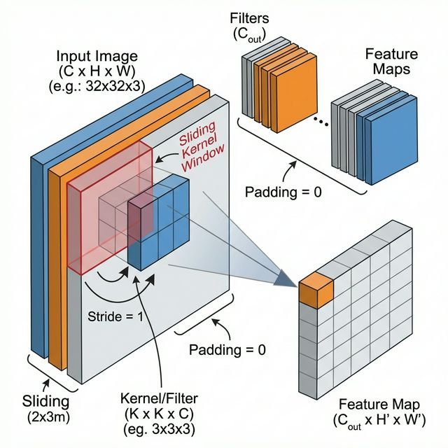
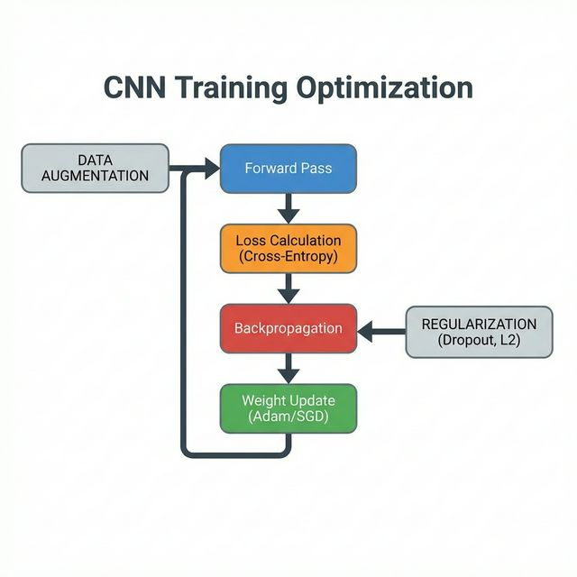

# Unit II: Convolutional Neural Networks (CNN) - Detailed Exam Notes

---

## 1. Convolution Edge Detection on Images
*   **The Problem**: A computer "sees" an image as a 2D matrix of numbers. To recognize objects, it must first find the "shapes."
*   **The Kernel (Filter)**: A small weight matrix (e.g., $3 \times 3$) that "slides" over the image. 
*   **Sobel Edge Filters**: Matrices designed to calculate the gradient of pixel intensity.

### Detailed Description
Edge Detection is the "eyes" of a Convolutional Neural Network. It is the process of identifying points in a digital image where the brightness changes sharply. These sharp changes are usually the outlines or boundaries of objects. By sliding a "filter" (a small grid of numbers) across the image, the computer performs a subtraction operation between neighboring pixels to see how much they differ. If the difference is high, an "edge" exists.

### Practical Example
If you have a photo of a white cat against a black background, the computer will see a 0 (black) right next to a 255 (white). The **Edge Detection filter** calculates this massive jump in value and renders a bright white line at that exact spot, effectively creating a "sketch" or "outline" of the cat.

---

## 2. Convolution Padding and Strides
*   **Padding ($P$)**: Adding a ring of zeros to preserve information at the borders and keep the image size constant.
*   **Strides ($S$)**: The jump distance of the filter.
*   **Formula**: Output Dimension $O = \lfloor \frac{N + 2P - F}{S} \rfloor + 1$.

### Detailed Description
**Padding** is like putting a "frame" or buffer around a photo. Without it, the pixels at the very edge of the photo are only "read" once by the computer, while the pixels in the middle are read many times. Padding ensures every part of the image is treated equally. **Stride** determines the resolution of the scan. A stride of 1 moves the window pixel-by-pixel, while a stride of 2 skips every other pixel, making the resulting image twice as small.

### Practical Example
Think of a person scanning a long newspaper with a small magnifying glass. **Padding** would be like taping extra white paper to the edges of the newspaper so they can scan the words at the very end of the page. **Stride** would be like the person moving the glass 1 inch at a time (Stride 1) versus leaping 5 inches at a time (Stride 5) to save time, even if it means missing some small details.

---

## 3. Convolution over RGB Images (Volume)
*   **The Concept**: Real-world images have 3 channels (Red, Green, Blue).
*   **Volume Operations**: A $3 \times 3$ filter must actually be $3 \times 3 \times 3$ to match the input.
*   **The Math**: All 27 values are multiplied and then summed into 1 single result.

### Detailed Description
A standard black-and-white image is just a flat sheet of numbers. A color image is like a "3-layered sandwich" of Red, Green, and Blue values. When a CNN performs a convolution on a color image, it doesn't just look at one layer; it uses a 3D "cube" filter that looks through all three colors simultaneously. It combines the information from all colors to decide if a feature (like a red apple) is present.

### Practical Example
Imagine you are looking for a specific Red marble in a jar of mixed marbles. If you only look at the "Shape" layer, you'll see many circles. If you look at the "Red" layer, you'll see many things. But by using an **RGB Convolution**, you are looking for "Round" AND "Red" at the exact same time, which allows you to find precisely what you are looking for in a single action.

---

## 4. Convolutional Layer (Deep Dive)
*   **Sparsity of Connections**: A neuron only connects to a tiny local patch, not the whole image.
*   **Weight Sharing**: The same filter weights are used for the whole image to save parameters.
*   **Parameter Count**: $(W \times H \times D + 1) \times \text{Filters}$.

### Detailed Description
The Convolutional Layer is the "brain" of the visual system. It consists of multiple "detectors" searching for different things (one filter looks for vertical lines, another for circles, another for green patches). Because a feature that is useful in one corner of a photo is usually useful in another, the layer uses "Weight Sharing." This means it doesn't need a new set of eyes for every part of the image, which makes CNNs much "lighter" and faster than traditional neural networks.

### Practical Example
Imagine a security team monitoring 100 cameras. A "Traditional" network would need 100 different guards, each watching only one screen. A **Convolutional Layer** is like having one super-fast "Virtual Guard" who can scan all 100 screens using the same set of rules. This guard is much cheaper to hire and just as effective at detecting a "burglar" no matter which camera they appear on.

---

## 5. Max-Pooling
*   **Definition**: A fixed operation that keeps only the strongest signal from each small window.
*   **Benefit**: Makes the network robust to "jitters" or small movements.

### Detailed Description
Max-Pooling is a method of "summary." It looks at a $2 \times 2$ square of data and says, "I don't need all four numbers; just give me the largest one." This serves two purposes: first, it makes the image smaller (saving computer memory); second, it makes the model less picky. If a "nose" in an image moves by 2 pixels, Max-Pooling will still catch it and pass the "nose" signal through to the next layer.

### Practical Example
Imagine you are a scout for a basketball team. You visit a neighborhood with 4 kids playing. One kid is 7 feet tall, and the other three are 5 feet tall. When you report back to your boss, you don't list all four heights; you just say, "The tallest kid is 7 feet." That is **Max-Pooling**—you are reporting the strongest feature and ignoring the rest.

---

## 6. CNN Training Optimization (Exam Highlight)
*   **Dropout**: A trick where we "kill" random neurons to prevent them from "memorizing" the training data (**Overfitting**).
*   **Adam Optimizer**: A smart algorithm that changes the speed of learning for every single weight based on how much it has changed recently.
*   **Data Augmentation**: Generating "fake" training data by spinning or flipping existing images.

### Detailed Description
Optimization is the process of "teaching" the network by showing it its mistakes. After an image passes through, we calculate a "Loss" (error score). We then use "Backpropagation" to reverse-engineer which filters were responsible for the mistake and tweak them. We use tricks like **Dropout** to make the network "study harder" and **Data Augmentation** to give it more practice problems to solve.

### Practical Example
A student is practicing for a math exam by solving 100 problems. If the student just "memorizes" the specific answers to those 100 problems, they will fail the exam because the exam will have *new* problems (**Overfitting**). To prevent this, the teacher changes the numbers in the problems slightly (**Data Augmentation**) and sometimes hides the formulas (**Dropout**) to force the student to truly learn the underlying logic.

---
**End of Unit II Comprehensive Notes**
