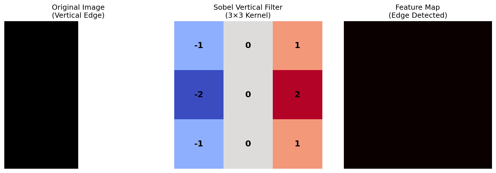
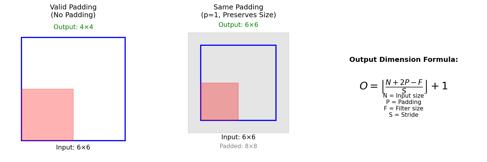
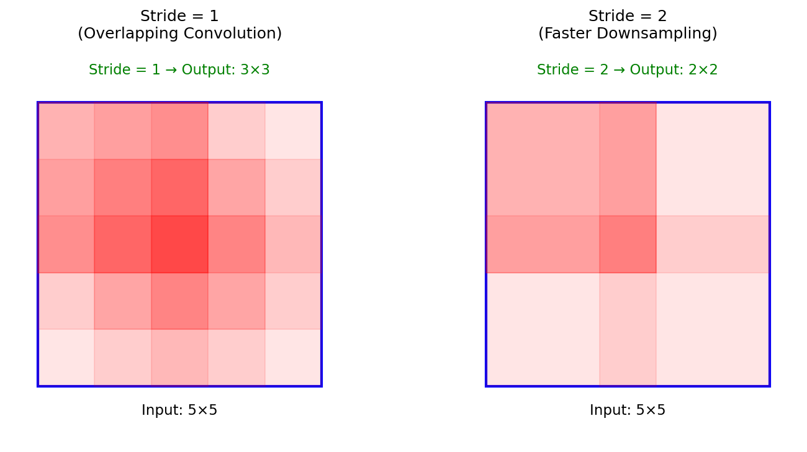
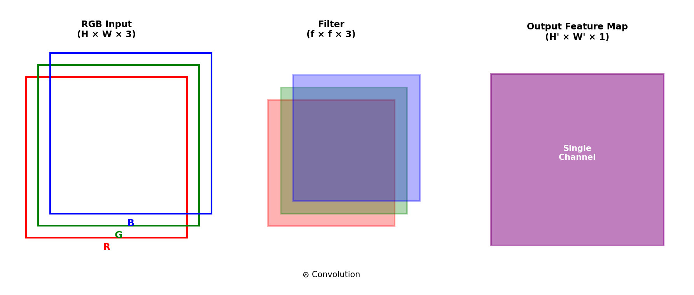
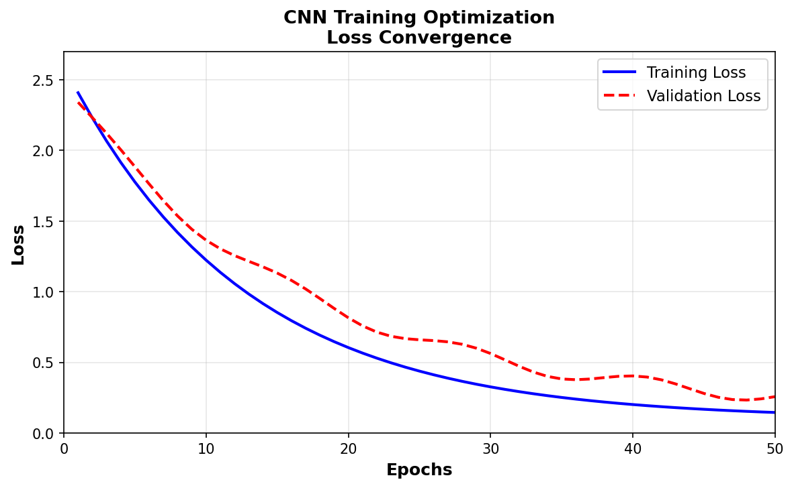

# Unit II: Convolutional Neural Networks (CNN)

---

## Topic 1: Convolution Edge Detection on Images

### Definition
- Edge detection identifies boundaries where pixel intensity changes sharply
- Uses convolution operation with specialized filters (kernels)
- Foundation for feature extraction in CNNs

### Key Concepts
- **Sobel Filter**: Detects vertical and horizontal edges using $3 \times 3$ kernels
- **Vertical Edge Filter**: $\begin{bmatrix} -1 & 0 & 1 \\ -2 & 0 & 2 \\ -1 & 0 & 1 \end{bmatrix}$
- **Horizontal Edge Filter**: $\begin{bmatrix} -1 & -2 & -1 \\ 0 & 0 & 0 \\ 1 & 2 & 1 \end{bmatrix}$
- Positive edges: Light to Dark transitions
- Negative edges: Dark to Light transitions
- CNNs learn optimal edge filters through backpropagation
- Filter values are **learnable parameters** unlike fixed traditional CV filters
- Convolution operation: Element-wise multiplication and summation

### Key Formula
**Convolution Output**:
$$G(x,y) = \sum_{i=-a}^{a} \sum_{j=-b}^{b} I(x+i, y+j) \cdot K(i,j)$$

Where:
- $I$ = Input image
- $K$ = Kernel/Filter
- $G$ = Output feature map
- $a, b$ = Kernel dimensions

**Edge Magnitude**:
$$|G| = \sqrt{G_x^2 + G_y^2}$$

Where $G_x$ and $G_y$ are horizontal and vertical gradients

### Exam Points
**Properties**:
- Captures spatial hierarchies
- Translation invariant
- Detects edges at any angle through learning

**Advantages**:
- Automatic feature learning
- Superior to hand-crafted filters
- Robust to variations

**Applications**:
- Object boundary detection
- Feature extraction (first CNN layers)
- Medical imaging edge analysis

**Source**: CNN Edge Detection Explained (YouTube - Simplified AI Course)

---

## Topic 2: Convolution Padding

### Definition
- Adding extra border pixels (usually zeros) around input image
- Preserves spatial dimensions after convolution
- Ensures border pixels participate equally in feature detection

### Key Concepts
- **Valid Padding ($p=0$)**: No padding, output shrinks
- **Same Padding**: Output size equals input size
- **Zero Padding**: Most common, adds zeros around borders
- Border pixels participate in fewer convolutions without padding
- Multiple conv layers without padding → rapid size reduction
- Padding prevents information loss at image boundaries

### Key Formula
**Output Dimension with Padding**:
$$O = \left\lfloor\frac{N + 2P - F}{S}\right\rfloor + 1$$

Where:
- $N$ = Input size (height/width)
- $P$ = Padding
- $F$ = Filter size
- $S$ = Stride
- $O$ = Output size

**Same Padding Calculation**:
$$P = \frac{F - 1}{2}$$
(Ensures input size = output size when $S=1$)

### Exam Points
**Properties**:
- Preserves spatial information
- Controls output dimensions
- Typically uses odd-sized filters ($3 \times 3$, $5 \times 5$)

**Advantages**:
- Retains border information
- Enables deeper networks
- Symmetric convolution operation

**Disadvantages**:
- Increases computation slightly
- May introduce artificial boundaries

**Applications**:
- Semantic segmentation (spatial precision)
- Image-to-image tasks
- Deep CNN architectures (ResNet, VGG)

**Source**: Padding and Stride in CNN (YouTube - codebasics)

---

## Topic 3: Convolution Strides

### Definition
- Number of pixels filter moves during each convolution step
- Controls spatial downsampling rate
- Affects receptive field growth

### Key Concepts
- **Stride = 1**: Filter moves one pixel at a time (standard)
- **Stride = 2**: Filter moves two pixels, reduces output by ~50%
- Larger stride → faster receptive field expansion
- Trade-off: Speed vs. Information retention
- Reduces computational cost significantly
- Alternative to pooling for downsampling

### Key Formula
**Output with Stride**:
$$H_{out} = \left\lfloor\frac{H + 2P - F}{S}\right\rfloor + 1$$
$$W_{out} = \left\lfloor\frac{W + 2P - F}{S}\right\rfloor + 1$$

Where:
- $H, W$ = Input height, width
- $P$ = Padding
- $F$ = Filter size
- $S$ = Stride

**Example**: $7 \times 7$ input, $3 \times 3$ filter, $S=2, P=0$
$$O = \left\lfloor\frac{7 - 3}{2}\right\rfloor + 1 = 3$$

### Exam Points
**Properties**:
- Stride > 1 causes information loss
- Accelerates network depth progression
- Non-overlapping when stride = filter size

**Advantages**:
- Reduces computation and memory
- Faster training and inference
- Controls feature map resolution

**Disadvantages**:
- May skip important features
- Less translation invariance
- Requires careful hyperparameter tuning

**Applications**:
- Object detection (multi-scale features)
- Real-time video processing
- Mobile/embedded CNN models

**Source**: Convolutions - Padding, Stride (YouTube - D2L.ai)

---

## Topic 4: Convolution over RGB Images

### Definition
- Extending 2D convolution to 3D inputs (color images)
- Filters have depth matching input channels
- Produces single-channel output per filter

### Key Concepts
- **RGB Input**: Height $\times$ Width $\times$ 3 channels
- **Filter Depth**: Must match input channels (3 for RGB)
- Each filter channel convolves with corresponding input channel
- Results summed across channels → single 2D feature map
- Multiple filters → multiple output channels
- Filter shape: $f \times f \times n_c^{in}$ where $n_c^{in}$ = input channels

### Key Formula
**Convolution over Volume**:
$$Z^{[l]}(i,j,k) = \sum_{c=0}^{n_c^{in}-1} \sum_{a=0}^{f-1} \sum_{b=0}^{f-1} W^{[l]}(a,b,c,k) \cdot A^{[l-1]}(i+a, j+b, c) + b^{[l]}_k$$

Where:
- $n_c^{in}$ = Input channels
- $k$ = Output channel index
- $W$ = Weights
- $b$ = Bias

**Output Dimensions**:
- Input: $n_H \times n_W \times n_c$
- Filters: $f \times f \times n_c \times n_{filters}$
- Output: $n_H' \times n_W' \times n_{filters}$

### Exam Points
**Properties**:
- Each filter detects one feature type across all channels
- Output depth = number of filters
- Learnable parameters = $(f \times f \times n_c + 1) \times n_{filters}$

**Advantages**:
- Captures color patterns
- Efficient parameter sharing
- Extensible to any number of channels

**Applications**:
- Color image classification
- RGB to feature extraction
- Multi-channel medical imaging (MRI sequences)

**Important Differences**:
- Grayscale: 2D convolution ($H \times W$)
- RGB: 3D convolution ($H \times W \times 3$)
- Output always flattens depth from one filter to single channel

**Source**: Convolution over RGB Images (YouTube - D2L.ai)

---

## Topic 5: Convolutional Layer

### Definition
- Core building block of CNN
- Applies multiple learnable filters to extract features
- Outputs multi-channel feature maps

### Key Concepts
- **Input**: $n_H \times n_W \times n_c^{in}$
- **Filters**: $n_{filters}$ kernels of size $f \times f \times n_c^{in}$
- **Output**: $n_H' \times n_W' \times n_{filters}$
- Each filter → one output channel
- **Activation Function**: ReLU typically applied after convolution
- **Bias**: One per filter, added to entire feature map
- **Weight Sharing**: Same filter weights across spatial locations
- **Local Connectivity**: Each neuron connects to small region

### Key Formula
**Forward Pass**:
$$A^{[l]} = g(Z^{[l]})$$
$$Z^{[l]} = W^{[l]} * A^{[l-1]} + b^{[l]}$$

Where:
- $*$ = Convolution operation
- $g$ = Activation function (ReLU)
- $l$ = Layer index

**Learnable Parameters**:
$$\text{Params} = (f \times f \times n_c^{in} + 1) \times n_{filters}$$

### Exam Points
**Properties**:
- Sparse interactions (local receptive fields)
- Parameter sharing reduces model size
- Equivariant to translation

**Advantages**:
- Fewer parameters than fully connected layers
- Captures spatial hierarchies
- Computationally efficient

**Applications**:
- Feature extraction (all CNN architectures)
- Pattern recognition
- Spatial feature learning

**Source**: Convolutional Layer Fundamentals

---

## Topic 6: Max Pooling

### Definition
- Downsampling operation selecting maximum value from each region
- Reduces spatial dimensions while retaining important features
- Non-learnable, no parameters to train

### Key Concepts
- **Pooling Window**: Typically $2 \times 2$
- **Stride**: Usually equals pool size (non-overlapping)
- **Operation**: Takes max value from each window
- Reduces height and width, preserves depth
- Provides **translation invariance**
- Controls overfitting by reducing parameters
- **Average Pooling**: Alternative using mean instead of max

### Key Formula
**Output Dimensions**:
$$H_{out} = \left\lfloor\frac{H - f_{pool}}{s}\right\rfloor + 1$$
$$W_{out} = \left\lfloor\frac{W - f_{pool}}{s}\right\rfloor + 1$$

Where:
- $f_{pool}$ = Pooling window size
- $s$ = Stride

**Backward Pass** (Gradient):
$$\frac{\partial L}{\partial x_i} = \begin{cases} \frac{\partial L}{\partial y} & \text{if } x_i = \max \\ 0 & \text{otherwise} \end{cases}$$

Only maximum value location receives gradient.

### Exam Points
**Properties**:
- No learnable parameters
- Fixed operation (deterministic)
- Dimension reduction: ~75% with $2 \times 2$ pooling

**Advantages**:
- Reduces computation and memory
- Provides translation invariance
- Controls overfitting
- Makes features robust to small shifts

**Disadvantages**:
- Loses spatial information
- Not suitable for precise localization tasks
- Discards potentially useful data

**Applications**:
- Image classification (after conv layers)
- Feature compression
- Intermediate layers in CNNs (VGG, AlexNet)

**Source**: Max Pooling in CNN (YouTube - Navid Shirzadi)

---

## Topic 7: CNN Training Optimization

### Definition
- Process of minimizing loss function to learn optimal filter weights
- Uses backpropagation through convolutional layers
- Applies gradient-based optimization algorithms

### Key Concepts
- **Loss Function**: Cross-entropy (classification), MSE (regression)
- **Optimizer**: Adam, SGD, RMSprop
- **Learning Rate**: Critical hyperparameter, typically 0.001-0.0001
- **Batch Size**: 32, 64, 128
- **Data Augmentation**: Rotation, flip, crop to prevent overfitting
- **Regularization**: Dropout, L2 weight decay
- **Batch Normalization**: Accelerates training, stabilizes gradients
- **Early Stopping**: Prevents overfitting using validation loss

### Key Formula
**Gradient Descent Update**:
$$W^{[l]} := W^{[l]} - \alpha \frac{\partial L}{\partial W^{[l]}}$$

**Adam Optimizer**:
$$m_t = \beta_1 m_{t-1} + (1-\beta_1) g_t$$
$$v_t = \beta_2 v_{t-1} + (1-\beta_2) g_t^2$$
$$W := W - \alpha \frac{m_t}{\sqrt{v_t} + \epsilon}$$

Where:
- $\alpha$ = Learning rate
- $g_t$ = Gradient at time $t$
- $\beta_1, \beta_2$ = Momentum parameters
- $\epsilon$ = Small constant

### Exam Points
**Properties**:
- Backpropagation through convolution = convolution with flipped kernel
- Gradient flows through pooling only to max locations
- Chain rule applies through all layers

**Advantages**:
- End-to-end learning
- Automatic feature hierarchy learning
- Generalizes well with proper regularization

**Source**: CNN Training Optimization (YouTube - Rajasekhar Classes)

---

## Summary Table: Key CNN Operations

| Operation | Input | Output | Parameters | Purpose |
|-----------|-------|--------|------------|---------|
| **Convolution** | $H \times W \times C$ | $H' \times W' \times F$ | $(f \times f \times C+1) \times F$ | Feature extraction |
| **Padding** | $H \times W \times C$ | $(H+2P) \times (W+2P) \times C$ | 0 | Preserve dimensions |
| **Stride** | $H \times W \times C$ | $H' \times W' \times C$ | 0 | Downsample |
| **Max Pooling** | $H \times W \times C$ | $H/2 \times W/2 \times C$ | 0 | Dimension reduction |

---

## Important Formulas Quick Reference

1. **Output Size**: $O = \left\lfloor\frac{N + 2P - F}{S}\right\rfloor + 1$

2. **Receptive Field Growth**: $r_{l+1} = r_l + (f-1) \times \prod_{i=1}^{l} s_i$

3. **Parameters in Conv Layer**: $(f \times f \times n_c^{in} + 1) \times n_{filters}$

4. **Max Pooling Reduction**: Output = Input $\times \frac{1}{f_{pool}^2}$ (spatial only)

---

**End of Unit II Notes**
