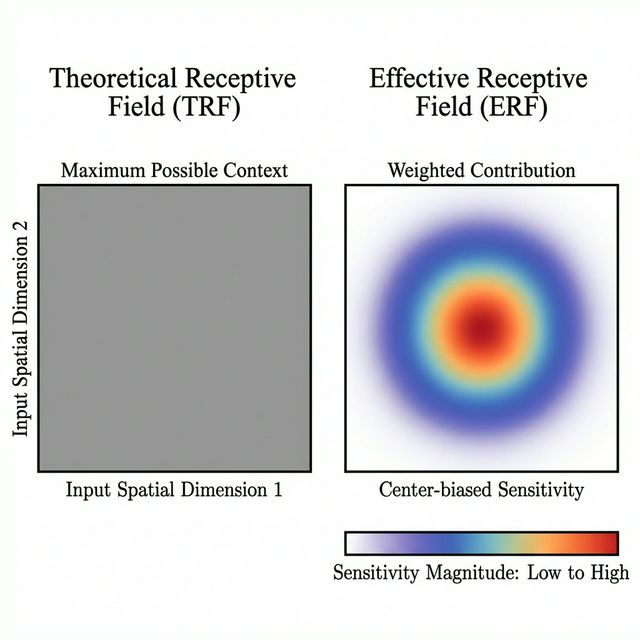
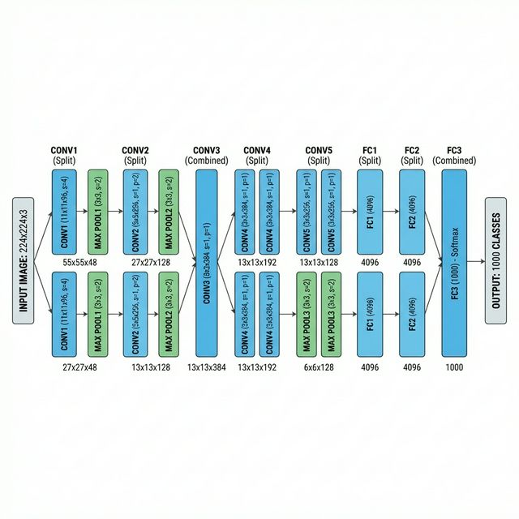
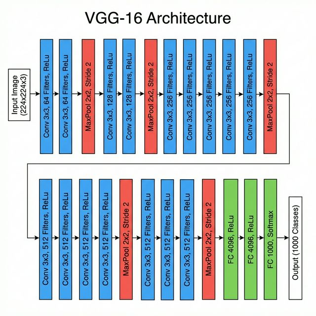

# Unit III: CNN Architectures & Advanced Concepts - Comprehensive Exam Notes

---

## 1. Receptive Fields (RF) and Effective RF (ERF)
*   **Theoretical Receptive Field (TRF)**: The total area of the input image that *mathematically* could affect a neuron. 
*   **Effective Receptive Field (ERF)**: The central Gaussian-shaped region where the gradients are actually high.
*   **Growth**: RF size grows as the network gets deeper.

### Detailed Description
The Receptive Field is the "window" of the original image that a specific neuron in a deep layer is actually "looking" at. In the first layer, a neuron might only see 3x3 pixels. But because the next layer looks at a 3x3 block of *those* neurons, its "window" into the original image is much larger. The **Effective Receptive Field** is the discovery that neurons don't pay equal attention to the whole window; they focus mostly on the center and ignore the corners.

### Practical Example
Imagine you are looking at a giant mural through a small piece of cardboard with a hole in it. If you stand 1 inch away from the mural, you can only see a single "letter" (**Small Receptive Field**). If you take 20 steps back, you can see the entire "Word" through the exact same hole (**Large Receptive Field**). Deep networks "step back" with every layer to see more of the picture.

---

## 2. Example CNN: LeNet-5 [1998]
*   **History**: Designed for handwritten check digits (MNIST).
*   **Legacy**: Introduced the standard Conv-Pool-Conv-Pool architecture.
*   **Pooling**: Used **Average Pooling** rather than the modern Max-Pooling.

### Detailed Description
LeNet-5 is historical because it was the first time a Convolutional Neural Network was used in a successful commercial product. In the 1990s, it processed over 10% of all checks written in the United States. It used a "low-to-high" hierarchy: the first layers looked for tiny lines, the next layers combined those lines into "curves," and the final layers identified those curves as digits like "5" or "8."

### Practical Example
Consider the automated "Sorting Machines" used in a post office to read the Zip Code on an envelope. The core logic of the very first world-class sorting machines was based on **LeNet-5**. It was able to look at messy, human handwriting and accurately "decipher" the numbers to send the letter to the right city.

---

## 3. ImageNet Dataset
*   **Project**: 14M+ images, 20k+ categories.
*   **Impact**: Enabled the training of "Deep" networks for the first time by providing enough data.

### Detailed Description
ImageNet is the "Dictionary of the Visual World." Before ImageNet, computer vision researchers didn't have enough data to train deep models, so the models were very weak. ImageNet changed this by organizing millions of photos into thousands of categories. This allowed AI to "learn by example" on a scale that was previously impossible, paving the way for technologies like FaceID and self-driving cars.

### Practical Example
Think of a child who has only ever seen 2 or 3 dogs in their life. They might be confused when they see a "Great Dane" for the first time. But a child who has seen a massive "ImageNet-style" book with 10,000 photos of different dog breeds will immediately recognize any dog they see. **ImageNet** is that 10,000-photo book for computers.

---

## 4. Data Augmentation
*   **Techniques**: Flip, Rotate, Shear, Zoom, Color Jitter.
*   **Problem Solved**: **Overfitting**. It makes a model see "more" data than actually exists.

### Detailed Description
Data Augmentation is a way to "artificially" grow your training data without actually taking any new photos. We take the images we already have and "warp" them in ways that don't change what the object is. This forces the model to learn the "essence" of an object. For example, if we flip a picture of an airplane, it's still an airplane. If we don't do this, the model might only learn to recognize airplanes flying from left to right.

### Practical Example
Suppose you are teaching a baby to recognize a "Banana." If you only ever show them a yellow banana on a white plate, they might think "Red" things can't be bananas. By using **Data Augmentation**, you would show the baby the banana from the side, upside down, in bright light, in a shadow, or even a slightly green one. This ensures the baby truly knows what a banana is in any situation.

---

## 5. Convolution Layers in Keras
*   **Syntax**: `model.add(Conv2D(filters=64, kernel_size=(3,3), activation='relu'))`.
*   **ReLU**: A simple function that keeps positive numbers and turns all negative numbers to 0.

### Detailed Description
Keras is a "user-friendly" coding library that allows programmers to build complex CNNs like LEGOs. Instead of writing 500 lines of complicated math code for a single layer, you can do it in 1 line. **ReLU** is the preferred activation function because it "wakes up" the network, allowing it to learn much faster than the older "Sigmoid" math used in the 1990s.

### Practical Example
Building a CNN in Keras is like using a **Smart Home Kit**. In the past, if you wanted a smart light, you had to be an electrical engineer to wire the whole house. With Keras, you just "plug in" a pre-made smart bulb and it works immediately. You can add as many "layers" of smart features as you want without needing to worry about the wiring.

---

## 6. AlexNet (2012)
*   **Breakthrough**: Won the 2012 ImageNet challenge by a huge 10.8% margin over 2nd place.
*   **Hardware**: First to use **GPUs** for training instead of slower CPUs.

### Detailed Description
AlexNet is the most famous model in the history of AI. It was the "Big Bang" of the modern Deep Learning era. Before 2012, most experts thought small neural networks were useless. AlexNet was 8 layers deep and used powerful graphics cards (GPUs) to "crunch" millions of numbers simultaneously. It was so much better than anything else that it convinced the entire world that Deep Learning was the future.

### Practical Example
In the world of computers, **AlexNet** was like the "Super Mario Bros" for gaming. Before Mario, games were very simple and basic. After Mario became a massive hit, it showed the world how deep and complex video games could really be, and every gaming company started trying to copy that success.

---

## 7. VGGNet [2014]
*   **Small Filters**: Concluded that multiple $3 \times 3$ filters are better than one $7 \times 7$ or $11 \times 11$.
*   **Depth**: Famous for having 16 or 19 layers (very "Deep" for its time).

### Detailed Description
VGGNet is loved by researchers because of its "Simplicity." While AlexNet had many different-sized layers, VGG had only one rule: "Just use 3x3 squares for everything." It proved that you don't need complex, oversized filters to recognize objects. By stacking three small 3x3 filters, the network gets the same result as one 7x7 filter but with much less "clutter" and better accuracy.

### Practical Example
Think of building a wall. You could use one giant, heavy boulder (**Large Filter**) or you could use 20 small, standard rectangular bricks (**Small Filters**). While the boulder is faster to place, the 20 small bricks allow you to build a much more precise and detailed wall with fewer gaps. That is the **VGGNet** philosophy.

---

## 8. Residual Network (ResNet)
*   **The Problem**: **Degradation**. In very deep nets, gradients "vanish" (become 0) and training stops.
*   **The Solution**: **Skip Connections**.

### Detailed Description
Before ResNet, AI experts hit a "Wall." They tried to build networks with 50 or 100 layers, but the networks actually performed *worse* than 20-layer networks. This was because the information got "lost" as it passed through so many layers. ResNet solved this with "shortcuts" (Skip Connections) that let the information jump over layers. This simple fix allowed us to build the super-powerful 152-layer models we use today.

### Practical Example
Imagine you are playing a game of "Telephone" where 100 people are standing in a line. By the time the message reaches the 100th person, it will be complete nonsense. **ResNet** is like giving the 1st person a "Megaphone." Even if the people in the middle get the message wrong, the 100th person can still hear the "Shortcut" signal from the megaphone loud and clear.

---
**End of Unit III Comprehensive Notes**
