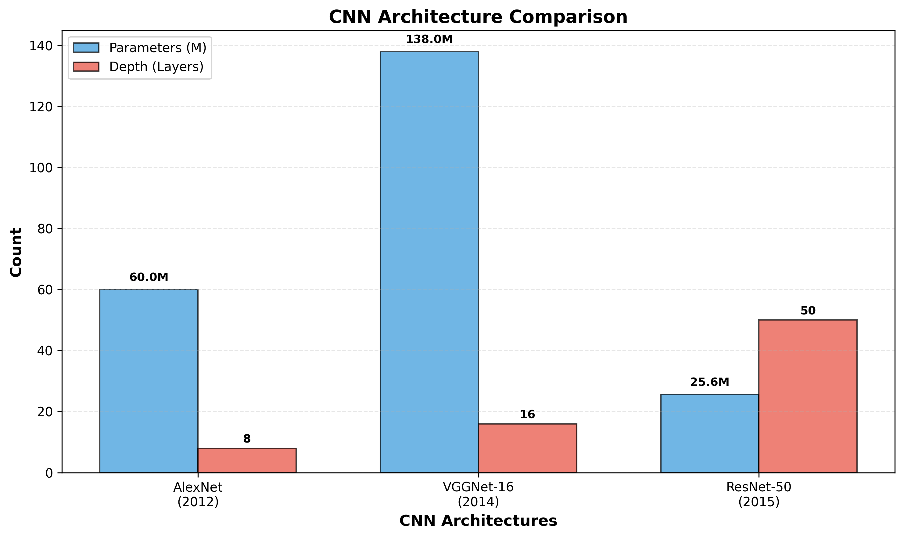

# Unit-III: CNN Architectures and Advanced Concepts

---

## Topic 1: Receptive Fields

### Definition
- Region of input image that influences a neuron's output
- Area of input pixels that contribute to activation of feature
- Grows with network depth through layers

### Key Concepts
- **Theoretical RF**: Maximum input region mathematically possible
- **Formula**: $r_n = r_{n-1} + (k_n - 1) \times \prod_{i=1}^{n-1} s_i$
  - $r_n$ = receptive field at layer $n$
  - $k_n$ = kernel size at layer $n$
  - $s_i$ = stride at layer $i$
- Increases additively with each conv layer
- Pooling layers multiply RF size by pooling factor
- Deeper layers see larger input regions
- $3 \times 3$ kernel increases RF by 2 pixels per layer
- Stacking layers expands coverage area

### Key Formula
$$RF_{n} = RF_{n-1} + (k - 1) \times stride$$
- $RF_n$: Receptive field at layer $n$
- $k$: Kernel size
- $stride$: Stride of previous layers

### Exam Points
**Properties:**
- Grows linearly with conv layers
- Grows exponentially with pooling layers
- Central pixels have strongest influence

**Advantages:**
- Hierarchical feature extraction
- Translation invariance
- Parameter sharing efficiency

**Applications:**
- Object detection (needs large RF)
- Image segmentation
- Feature localization

### Source
CNN Receptive Field | Deep Learning Animated (0:00-3:00)


---

## Topic 2: Effective Receptive Fields (ERF)

### Definition
- Actual region that significantly impacts neuron output
- Central pixels contribute more than peripheral pixels
- Gaussian distribution pattern in practice

### Key Concepts
- $ERF < Theoretical RF$ in deep networks
- Central region has maximum gradient contribution
- Grows as $O(\sqrt{n})$ where $n$ = number of layers
- Occupies only $O(1/\sqrt{n})$ of theoretical RF
- Weight initialization affects ERF distribution
- Training shifts ERF toward relevant features
- Random weights show rough Gaussian shape
- Dropout affects ERF coverage pattern

### Key Formula
$$ERF \approx \frac{TRF}{\sqrt{n}}$$
- $ERF$: Effective receptive field
- $TRF$: Theoretical receptive field
- $n$: Network depth (layers)

### Exam Points
**Properties:**
- Gaussian distribution centered on neuron
- Smaller than theoretical RF
- Increases with training iterations

**Advantages:**
- Focuses on relevant features
- Reduces noise sensitivity
- Efficient information usage

**Disadvantages:**
- Peripheral information underutilized
- May miss global context
- Requires deeper networks for large objects

**Applications:**
- Understanding CNN behavior
- Architecture design decisions
- Debugging network performance

### Source
Understanding the Effective Receptive Field in Deep CNNs (Paper 2016)

---

## Topic 3: LeNet-5 Architecture (1998)

### Definition
- First successful CNN for handwritten digit recognition
- Designed by Yann LeCun at AT&T Bell Labs
- Revolutionary for automatic feature learning

### Key Concepts
- 7 layers: Input → C1 → S2 → C3 → S4 → C5 → F6 → Output
- **C1**: Conv 6 filters ($5 \times 5$) → $28 \times 28 \times 6$
- **S2**: AvgPool ($2 \times 2$) → $14 \times 14 \times 6$
- **C3**: Conv 16 filters ($5 \times 5$) → $10 \times 10 \times 16$
- **S4**: AvgPool ($2 \times 2$) → $5 \times 5 \times 16$
- **C5**: Conv 120 filters → 120 neurons
- **F6**: Fully connected 84 neurons
- **Output**: 10 classes (digits 0-9)
- 60,000 parameters total
- Used tanh activation function
- Average pooling instead of max pooling
- Trained on MNIST dataset ($28 \times 28$ grayscale)
- Achieved 0.95% error rate on test set

### Key Formula
**Parameter Count:**
$$P = \sum (k_w \times k_h \times c_{in} \times c_{out}) + bias$$
- $k_w, k_h$: Kernel dimensions
- $c_{in}$: Input channels
- $c_{out}$: Output filters

### Exam Points
**Properties:**
- Simple sequential architecture
- Alternating conv-pooling pattern
- Progressive feature abstraction

**Advantages:**
- Automatic feature extraction
- Weight sharing reduces parameters
- Translation invariant features
- Efficient for small images

**Disadvantages:**
- Limited to small images ($32 \times 32$)
- Shallow architecture
- Tanh slower than ReLU
- High computational cost for era

**Applications:**
- Bank check reading
- ZIP code recognition
- Document digitization
- Handwritten digit classification

### Source
The ORIGINAL CNN: LeNet-5 (1998) | Gradient-Based Learning Paper


---

## Topic 4: ImageNet Dataset

### Definition
- Large-scale visual recognition dataset
- 14+ million hand-annotated images
- Organized hierarchically using WordNet

### Key Concepts
- Created by Fei-Fei Li (2007-2009)
- 1000 object categories for ILSVRC challenge
- Images: 1.2M training, 50K validation, 100K test
- Average 500-1000 images per category
- Labeled using Amazon Mechanical Turk
- Resolution varies (resized to $256 \times 256$ typically)
- ILSVRC = ImageNet Large Scale Visual Recognition Challenge
- Benchmark for CNN architectures since 2010

### Exam Points
**Properties:**
- Multi-scale object sizes
- Natural scene diversity
- Quality-controlled annotations

**Advantages:**
- Large-scale training data
- Hierarchical organization
- Real-world image diversity
- Transfer learning source

**Disadvantages:**
- Annotation errors exist
- Dataset bias toward certain categories
- Computationally expensive to use
- Storage requirements (150GB+)

**Applications:**
- CNN architecture benchmarking
- Transfer learning pre-training
- Object detection training
- Feature extraction backbone

### Source
AlexNet and ImageNet: The Birth of Deep Learning (2012)


---

## Topic 5: Data Augmentation

### Definition
- Artificially expanding training data through transformations
- Creates variations without collecting new images
- Reduces overfitting and improves generalization

### Key Concepts
- **Rotation**: Rotate images by random angles ($\pm 15$-$30^\circ$)
- **Horizontal/Vertical Flip**: Mirror transformations
- **Zoom**: Random scaling ($0.8$-$1.2 \times$)
- **Translation/Shift**: Move image within frame
- **Brightness/Contrast**: Adjust pixel intensity
- **Color Jitter**: Modify RGB channels randomly
- **Random Crop**: Extract patches from larger images
- **Gaussian Noise**: Add small random noise
- **Elastic Deformation**: Warp image locally
- **Cutout/Random Erasing**: Mask rectangular regions
- Applied during training (on-the-fly)
- Multiplies effective dataset size
- Specific to computer vision domain

### Key Formula
**Effective Dataset Size:**
$$D_{eff} = D_{original} \times N_{augmentations}$$
- Multiple augmentations increase diversity exponentially

### Exam Points
**Properties:**
- Preserves label information
- Creates realistic variations
- Computationally cheap

**Advantages:**
- Reduces overfitting significantly
- No additional data collection needed
- Improves model robustness
- Forces learning invariant features

**Disadvantages:**
- Increases training time slightly
- May create unrealistic samples
- Domain knowledge required for selection
- Some augmentations may harm performance

**Applications:**
- Small dataset training
- Medical image analysis
- Face recognition
- Object detection

### Source
Data Augmentation for CNNs (TensorFlow Tutorial)


---

## Topic 6: Convolution Layers in Keras

### Definition
- `Conv2D` layer in Keras for 2D spatial convolution
- Learns filters to extract features automatically
- Core building block of CNN architectures

### Key Concepts
```python
Conv2D(filters=32, kernel_size=(3,3), 
       strides=(1,1), padding='same',
       activation='relu', input_shape=(28,28,1))
```
- **filters**: Number of output feature maps
- **kernel_size**: Filter dimensions ($3 \times 3$, $5 \times 5$)
- **strides**: Step size for convolution
- **padding**: 'valid' (no padding) or 'same' (zero-pad)
- **activation**: ReLU, tanh, sigmoid
- **input_shape**: Required for first layer only
- Output shape: $(H_{out}, W_{out}, filters)$
- Parameters: $k_h \times k_w \times c_{in} \times filters + bias$

### Key Formula
**Output Dimensions:**
$$H_{out} = \frac{H_{in} + 2P - k_h}{stride} + 1$$
$$W_{out} = \frac{W_{in} + 2P - k_w}{stride} + 1$$
- $P$: Padding size
- $k_h, k_w$: Kernel dimensions

### Exam Points
**Properties:**
- Preserves spatial relationships
- Weight sharing across positions
- Local connectivity pattern

**Advantages:**
- Automatic feature learning
- Parameter efficient
- GPU-accelerated computation
- Easy to stack multiple layers

**Applications:**
- Image classification
- Object detection
- Semantic segmentation
- Feature extraction

### Source
Keras Conv2D Documentation | Building CNNs in Keras Tutorial

---

## Topic 7: AlexNet (2012)

### Definition
- Deep CNN that won ImageNet 2012 (ILSVRC)
- Reduced top-5 error from 26% to 15.3%
- Sparked deep learning revolution

### Key Concepts
- 8 layers: 5 convolutional + 3 fully connected
- **Conv1**: 96 filters ($11 \times 11$, stride 4) → $55 \times 55 \times 96$
- **Conv2**: 256 filters ($5 \times 5$) → $27 \times 27 \times 256$
- **Conv3**: 384 filters ($3 \times 3$) → $13 \times 13 \times 384$
- **Conv4**: 384 filters ($3 \times 3$) → $13 \times 13 \times 384$
- **Conv5**: 256 filters ($3 \times 3$) → $13 \times 13 \times 256$
- **FC6**: 4096 neurons
- **FC7**: 4096 neurons
- **FC8**: 1000 classes (softmax)
- 60 million parameters total
- First to use **ReLU** activation (6$\times$ faster training)
- **Dropout** (0.5) in FC layers prevents overfitting
- **Local Response Normalization** (LRN)
- **Data Augmentation**: crops, flips, color jitter
- Trained on 2 NVIDIA GTX 580 GPUs (split architecture)
- Input: $224 \times 224 \times 3$ RGB images

### Key Formula
**ReLU Activation:**
$$f(x) = \max(0, x)$$
- Faster than sigmoid/tanh
- Mitigates vanishing gradient

### Exam Points
**Properties:**
- Deeper than LeNet (8 vs 7 layers)
- Overlapping max pooling ($3 \times 3$, stride 2)
- GPU parallelization architecture

**Advantages:**
- ReLU enables faster training
- Dropout reduces overfitting
- Data augmentation improves generalization
- GPU acceleration feasible

**Disadvantages:**
- 240MB model size
- Requires 2 GPUs for training
- High computational cost
- Many parameters (60M)

**Applications:**
- Image classification (ImageNet)
- Transfer learning backbone
- Feature extraction
- Object detection base

### Source
AlexNet: ImageNet Classification with Deep CNNs (Krizhevsky 2012)



---

## Topic 8: VGGNet (2014)

### Definition
- Very deep CNN with uniform $3 \times 3$ convolutions
- VGG-16 (16 layers) and VGG-19 (19 layers)
- Achieved 2nd place in ILSVRC 2014

### Key Concepts
- **Uniform architecture**: All conv filters $3 \times 3$
- **Max pooling**: $2 \times 2$, stride 2 (halves dimensions)
- **VGG-16 structure**:
  - Block 1: 2$\times$ Conv (64 filters) + MaxPool
  - Block 2: 2$\times$ Conv (128 filters) + MaxPool
  - Block 3: 3$\times$ Conv (256 filters) + MaxPool
  - Block 4: 3$\times$ Conv (512 filters) + MaxPool
  - Block 5: 3$\times$ Conv (512 filters) + MaxPool
  - FC: 4096 → 4096 → 1000
- VGG-16: 138M parameters
- VGG-19: 144M parameters
- Two $3 \times 3$ conv = one $5 \times 5$ receptive field
- Three $3 \times 3$ conv = one $7 \times 7$ receptive field
- Deeper with fewer parameters per layer
- Input: $224 \times 224 \times 3$ RGB

### Key Formula
**Receptive Field Equivalence:**
$$2 \times (3 \times 3) \equiv (5 \times 5)$$
$$3 \times (3 \times 3) \equiv (7 \times 7)$$
- Smaller filters stacked = same RF, fewer parameters

### Exam Points
**Properties:**
- Simple, homogeneous architecture
- Progressively increasing filter depth
- All conv layers use ReLU

**Advantages:**
- Deeper networks learn better features
- $3 \times 3$ filters reduce parameters vs $5 \times 5$ or $7 \times 7$
- Easy to understand and implement
- Strong performance on ImageNet

**Disadvantages:**
- Very large model size (528-574MB)
- Slow to train (high memory usage)
- Many FC layer parameters (90% of total)
- Requires significant GPU memory

**Applications:**
- Image classification
- Transfer learning (pre-trained weights)
- Semantic segmentation backbone
- Style transfer

### Source
VGGNet Paper (Simonyan & Zisserman 2014) | VGGNet Explained

---

## Topic 9: Residual Networks (ResNet)

### Definition
- Introduces skip connections (residual learning)
- Enables training of very deep networks (50-152 layers)
- Won ILSVRC 2015 with 3.6% error

### Key Concepts
- **Skip Connection**: $H(x) = F(x) + x$
  - $F(x)$: Learned residual mapping
  - $x$: Identity shortcut
- Residual block learns $F(x) = H(x) - x$
- Solves **vanishing gradient** problem
- **ResNet-50**: 50 layers, 25.6M parameters
- **ResNet-101**: 101 layers, 44.5M parameters
- **ResNet-152**: 152 layers, 60.2M parameters
- **Bottleneck blocks**: $1 \times 1 \rightarrow 3 \times 3 \rightarrow 1 \times 1$ conv
- Batch normalization after each conv
- Global average pooling instead of FC layers
- Identity shortcuts require no extra parameters
- Gradient flows directly through shortcuts

### Key Formula
**Residual Block:**
$$y = F(x, \{W_i\}) + x$$
- $F(x)$: Residual function
- $x$: Identity mapping
- If dimensions mismatch: $y = F(x) + W_s x$

### Exam Points
**Properties:**
- Skip connections every 2-3 layers
- Network can learn identity function easily
- Enables 100+ layer networks

**Advantages:**
- Solves vanishing gradient problem
- Deeper networks improve accuracy
- Easier optimization than plain CNNs
- Smaller model size than VGG

**Disadvantages:**
- Complex architecture design
- Higher computational cost for very deep models
- Memory usage increases with depth

**Applications:**
- Image classification (ImageNet)
- Object detection (Faster R-CNN)
- Semantic segmentation
- Instance segmentation (Mask R-CNN)

### Source
Deep Residual Learning for Image Recognition (He et al. 2015)


---

## Comparison Table: CNN Architectures

| Architecture | Year | Layers | Parameters | Top-5 Error | Key Innovation |
|--------------|------|--------|------------|-------------|----------------|
| LeNet-5 | 1998 | 7 | 60K | N/A | First CNN, conv layers |
| AlexNet | 2012 | 8 | 60M | 15.3% | ReLU, Dropout, GPU |
| VGGNet-16 | 2014 | 16 | 138M | 7.3% | Uniform $3 \times 3$ filters |
| ResNet-50 | 2015 | 50 | 25.6M | 3.6% | Skip connections |

---

## Evolution Timeline

**1998**: LeNet-5 → Handwritten digits  
**2012**: AlexNet → Deep learning revival  
**2014**: VGGNet → Deeper with uniform filters  
**2015**: ResNet → Solved vanishing gradient  

---

## Key Takeaways

1. **Receptive field** grows with depth; use pooling for exponential growth
2. **Effective RF** is Gaussian, smaller than theoretical
3. **LeNet** pioneered CNN architecture pattern
4. **ImageNet** enabled large-scale CNN training
5. **Data augmentation** essential for generalization
6. **AlexNet** introduced ReLU + Dropout
7. **VGGNet** showed deeper = better with small filters
8. **ResNet** skip connections enable 100+ layers

---

**End of Unit-III Notes**
