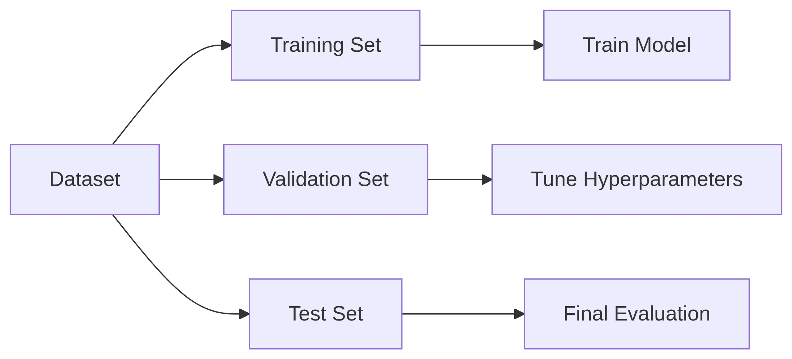

## Question 1: Explain the Types of Explanations in Explainable AI. Illustrate with Suitable Examples.

### Introduction to Explanations in XAI
Explainable AI (XAI) makes complex AI models understandable to humans. It answers "why" a model made a specific prediction, building trust, enabling debugging, and ensuring fairness.

#### Key Types of Explanations in XAI
1. **Global explanations:** Describe overall model behavior across the full dataset.
2. **Local explanations:** Explain one specific prediction for one instance.
3. **Contrastive explanations:** Clarify why prediction X happened instead of Y.
4. **What-if explanations:** Show how prediction changes when inputs are varied.
5. **Counterfactual explanations:** Give minimal changes needed to flip an outcome.
6. **Example-based explanations:** Use similar/contrasting cases to justify predictions.

### 1. Global Explanations
- **Core Question:** *How does the model work overall?*
- **Description:** Provides a holistic view of the model's behavior across the entire dataset.
- **Examples:** Permutation Feature Importance, Partial Dependence Plots (PDP). Decision trees are intrinsically global.

### 2. Local Explanations
- **Core Question:** *Why did the model arrive at this specific prediction?*
- **Description:** Attributes a specific prediction to individual features for a single instance.
- **Examples:** **LIME** (Local Interpretable Model-Agnostic Explanations) and **SHAP** (SHapley Additive exPlanations).

### 3. Contrastive Explanations
- **Core Question:** *Why X and not Y?*
- **Description:** Explains why a certain prediction was made instead of an alternative. Useful for understanding minimal required changes.
- **Example:** "Loan denied because income `< 50k`; if `> 50k`, it would be approved." Tool: REASONX.

### 4. What-If Explanations
- **Core Question:** *What happens if I change the input?*
- **Description:** A sensitivity analysis showing how varying inputs affect predictions.
- **Example:** Individual Conditional Expectation (ICE) plots showing how cancer probability changes as a patient's age increases.

### 5. Counterfactual Explanations
- **Core Question:** *How to conditionally get a different outcome?*
- **Description:** Explains the minimal, actionable changes needed in the input to flip the prediction.
- **Example:** "You would have received the loan if your income was higher by $10,000". Tool: **DiCE**.

### 6. Example-Based Explanations
- **Core Question:** *Which instances are similar?*
- **Description:** Explains predictions by highlighting similar or contrasting instances from the training data.
- **Examples:** k-Nearest Neighbors (kNN), Prototypes, and Criticisms.

### Taxonomy by Scope and Stage
| Dimension | Categories | Description |
|-----------|------------|-------------|
| **Scope** | Global, Local | Global explains overall model; Local explains individual predictions. |
| **Stage** | Pre-Model, Intrinsic, Post-Hoc | Before training, self-explanatory, or applied after training. |
| **Model Dependency** | Model-Agnostic, Model-Specific | Works on any model (LIME) vs. architecture-specific (Grad-CAM). |

***

## Question 2: Explain Model Validation, Evaluation, and Hyperparameter Optimization Techniques

### Model Validation Techniques
Ensures the model generalizes to unseen data without overfitting or underfitting.

- **Holdout Method:** Simple split into train/test sets. Fast but wastes data.
- **K-Fold Cross-Validation:** Divides data into K folds. Trains on K-1, tests on 1. Averages metrics over K iterations.
- **Stratified K-Fold:** Maintains class distribution across folds, critical for imbalanced data.
- **Leave-One-Out (LOOCV):** K-fold where K is the number of data points. Computationally expensive.

### Model Evaluation
- **Classification:**
  - **Confusion Matrix:** Shows True/False Positives and Negatives.
  - **ROC & AUC:** Plots True Positive vs. False Positive rates. Higher AUC = better model.
  - **Precision-Recall Curve:** Better for imbalanced data.
- **Regression:**
  - **Residual Plots:** Difference between predicted and observed values. Random scatter indicates good fit.
- **Clustering:**
  - **Elbow Method:** Finds optimal clusters by plotting distortion scores.
  - **Silhouette Coefficient:** Measures cluster tightness and separation.

### Learning & Validation Curves
- **Validation Curve:** Plots performance vs. hyperparameter values to find the sweet spot before overfitting.
- **Learning Curve:** Plots performance vs. training size to diagnose data sufficiency, underfitting, or overfitting.

### Hyperparameter Optimization Techniques
Finds the best parameter configurations (like learning rate or max depth) for peak model performance.

| Technique | Approach | Pros & Cons |
|-----------|----------|-------------|
| **Grid Search** | Tests all predefined combinations. | Detailed but slow. |
| **Random Search** | Tests random combinations. | Faster, often misses the exact optimal set. |
| **Bayesian Opt.** | Uses a probabilistic model to guide search. | Efficient, learns from past tests, but complex. |

***

## Question 3: Explain Rules-Based Techniques in Interpretable Machine Learning

### Introduction
Rule-based models yield human-readable decision rules (IF-THEN statements) highly suitable for high-stakes domains (healthcare, justice, finance) because they are inherently interpretable.

### 1. Traditional Rule Induction
- **Separate-and-Conquer:** Learns a rule, removes covered data instances, and repeats until all positive cases are covered. Simple and logical.

### 2. Ensemble-Based Rule Techniques
- **RuleFit:** Generates rules from tree ensembles and fits a sparse linear model using those rules as features.
- **Skope-Rules:** Extracts precision-oriented rules from tree sub-samples and simplifies them.
- **Boosted Rulesets:** Uses AdaBoost to iteratively create simple rules, focusing on harder-to-classify instances.

### 3. Bayesian Rule-Based Methods
- **Bayesian Or's of And's (BOA):** Uses association rules and Bayesian priors to create an interpretable pattern set classifier.
- **Bayesian Rule Lists (BRL):** Produces a concise, prioritized IF-THEN-ELSE decision list based on a posterior probability distribution.
  - *Example:* IF male AND adult THEN survival: 21% ELSE IF 1st class THEN survival: 96%.
- **Bayesian Case Model (BCM):** Combines case-based reasoning and clustering, classifying based on a prototype case.

### 4. Certifiably Optimal Rule Lists (CORELS)
- **Concept:** A discrete optimization technique (branch-and-bound) that produces rule lists with a *certificate of optimality*.
- **How it Works:** It guarantees finding the most accurate rule list in a given search space by using analytical bounds (support bounds, accuracy bounds).
- **Practicality:** Fast and provably optimal, making it a strong alternative to black-box models for critical decisions.

### Practical Significance
Rule-based models perfectly balance the need for high accuracy with stringent transparency requirements (like GDPR). The assumption that interpretable models are inherently less accurate is outdated; modern methods like CORELS can match black-box performance.
