# Unit-I: Introduction to Explainable AI and Pre-Model Interpretability

## Topic: Black-Box Problem
### Definition
A black-box model is one whose internal decision process is not directly understandable to humans. We can observe input-output behavior, but not clear reasoning steps.

### Key Concepts
- Black-box models often give high accuracy but low interpretability.
- Typical black-box examples: Deep Neural Networks, Random Forests, and many SVM variants.
- In high-stakes settings (healthcare, finance, criminal justice), decisions must be explainable.
- White-box models (Decision Trees, Linear Regression, Logistic Regression) are easier to interpret but may be less powerful on complex tasks.

### Exam Points
- Main trade-off: predictive performance vs transparency.
- High accuracy alone is not enough; leakage and bias can still exist.

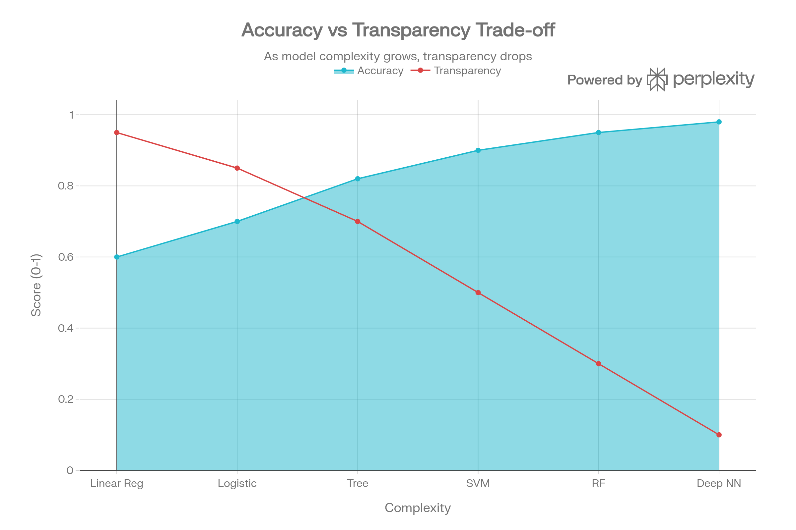

---

## Topic: Goals of XAI
### Definition
Explainable AI (XAI) aims to clarify how, why, and when a model gives a prediction.

### Key Concepts
- **Understandability**: overall model behavior can be grasped.
- **Comprehensibility**: model communicates information in human-friendly form.
- **Interpretability**: individual predictions or mechanisms can be explained.
- **Transparency**: internal model structure/algorithm is visible.
- Interpretability depends on audience (developer, regulator, domain expert, end user).

### Exam Points
| Goal | Meaning | Example |
|------|---------|---------|
| Understandability | Overall functioning is clear | Autoencoder-level intuition |
| Comprehensibility | Knowledge is human-readable | Rules, prototypes |
| Interpretability | Prediction reasoning is explainable | Decision path in tree |
| Transparency | Internal mechanism is visible | Linear model coefficients |

---

## Topic: Brief History of XAI
### Key Progression
- **Porphyrian Tree (3rd century)**: early interpretable hierarchy.
- **Expert Systems (1970s)**: rule-based and explainable, but rigid and hard to scale.
- **Case-Based Reasoning (1980s-90s)**: explain through similar past cases.
- **Bayesian Networks (1985 onward)**: probabilistic reasoning with interpretable dependencies.
- **Modern Deep Learning (2010s+)**: strong performance, but major black-box concerns.

### Exam Points
- Trend: as model complexity increased, direct explainability decreased.

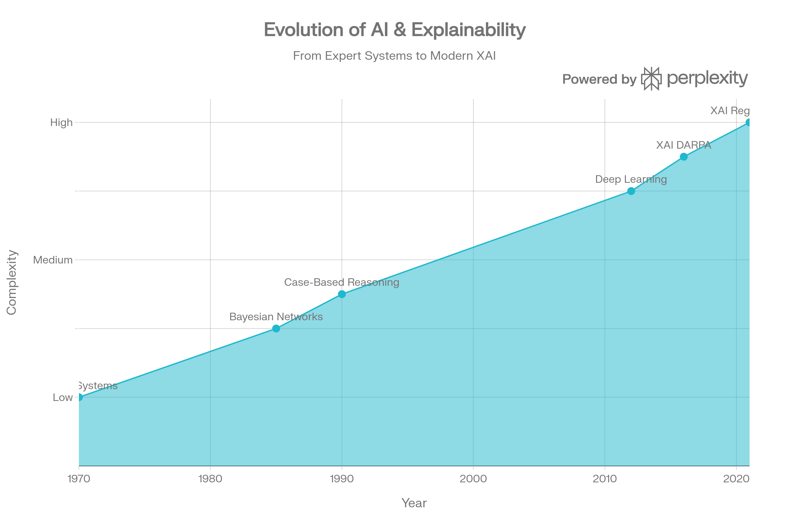

---

## Topic: Purpose of XAI
### Definition
XAI is required not only for technical debugging, but also for trust, fairness, safety, and governance.

### Nine Core Purposes
- Informativeness
- Trustworthiness
- Fairness
- Transparency
- Causality
- Transferability
- Reliability
- Accessibility
- Privacy

### Exam Points
- Trust equation:

\[
\text{Trust} = \frac{\text{Credibility} + \text{Reliability} + \text{Intimacy}}{\text{Self-orientation}}
\]

- Transparent model does not automatically mean fair model.
- Bias examples often discussed in exams: COMPAS and large language model social bias.

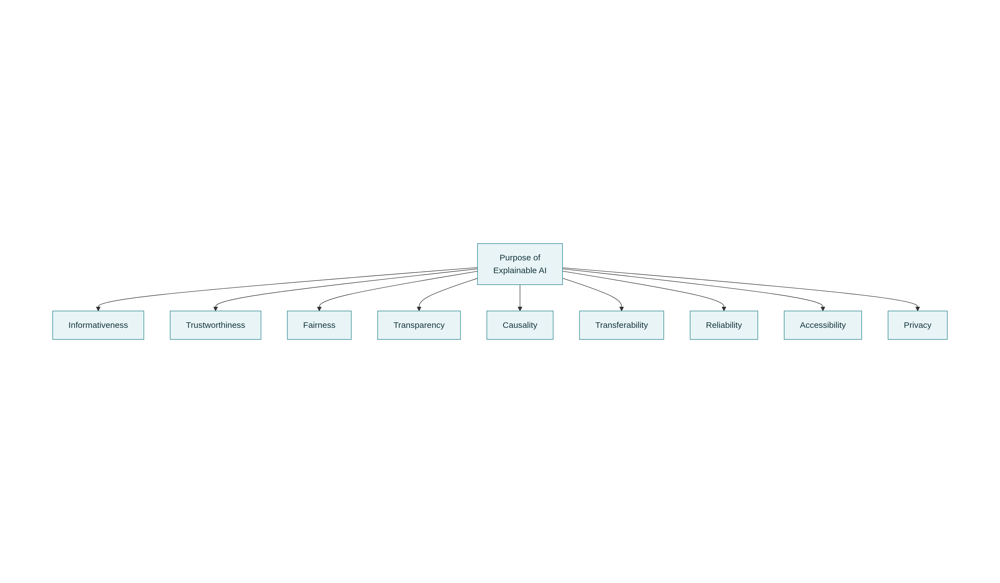

---

## Topic: Societal Impact of XAI
### Key Dimensions
- **Fairness and Bias**: detect and reduce discriminatory behavior.
- **Safety**: identify harmful failure modes before deployment.
- **Verifiability**: mathematically analyze whether model behavior stays within constraints.
- **Accountability**: assign responsibility for AI-assisted decisions.

### Exam Points
- More transparency does not always guarantee better accountability.
- Real-world systems can rarely be tested for every possible input condition.

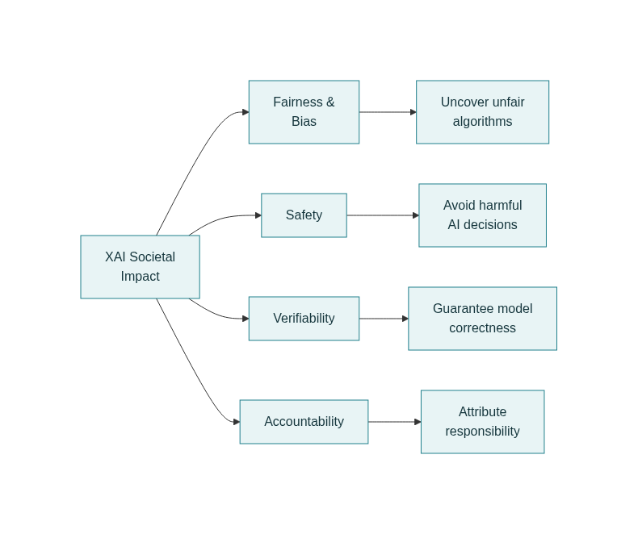

---

## Topic: Types of Explanations
### Definition
Different explanation types answer different practical questions.

### Main Types
- **Global**: How does the model behave overall?
- **Local**: Why this prediction?
- **Contrastive**: Why output X instead of Y?
- **What-if**: What happens if inputs or conditions change?
- **Counterfactual**: What minimum change gives the desired output?
- **Example-based**: Which similar instances justify this outcome?

### Exam Table
| Type | Core Question |
|------|---------------|
| Global | How does the model work? |
| Local | Why this prediction? |
| Contrastive | Why X and not Y? |
| What-if | What changes output? |
| Counterfactual | How to get desired outcome? |
| Example-based | Which similar cases support this? |

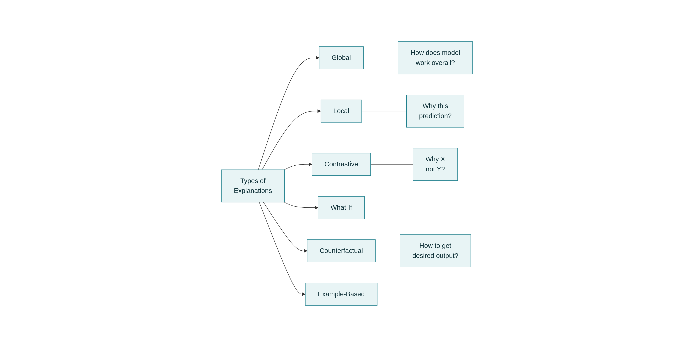

---

## Topic: Trade-offs in XAI
### Key Trade-offs
- **Completeness vs Interpretability**: richer models capture more behavior but become harder to explain.
- **Efficacy vs Privacy**: deeper explanations may reveal sensitive information.
- **Human Understandability vs Raw Accuracy**: best-performing models are not always easiest for humans to reason about.

### Exam Points
- No Free Lunch principle: no single model is best for all tasks.
- Practical target: explanations that are sufficiently faithful and sufficiently understandable.

---

## Topic: Taxonomy of XAI
### By Scope
- **Global methods**: explain whole-model behavior.
- **Local methods**: explain one instance or a small neighborhood.

### By Stage
- **Pre-model**: understand and prepare data before training (EDA, feature engineering).
- **Intrinsic**: inherently interpretable models (trees, linear models, GAMs).
- **Post-hoc**: explain trained models (LIME, SHAP, PDP, counterfactuals).

### Exam Points
- Pre-model and many post-hoc methods are model-agnostic.
- Some explainers are model-specific (for example, Grad-CAM for CNNs).

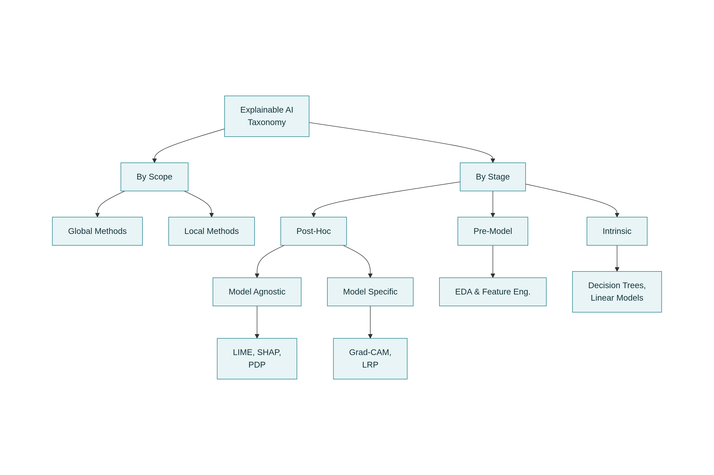

| Category | Applied To | Typical Methods |
|----------|------------|-----------------|
| Pre-model | Data | EDA, Feature Engineering |
| Intrinsic | Model design | Trees, Linear Models, GAMs |
| Post-hoc | Trained model | LIME, SHAP, PDP, Counterfactuals |
| Model-agnostic | Any model | Permutation importance, SHAP variants |
| Model-specific | Certain architectures | Grad-CAM, LRP |

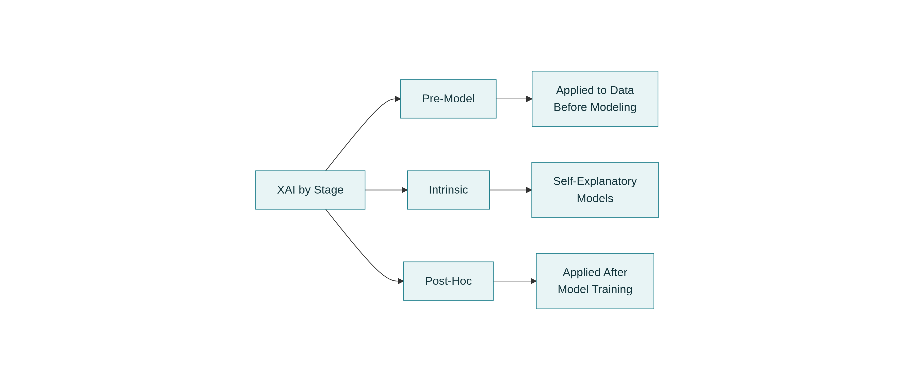

---

## Topic: Flowchart for Choosing XAI Methods
### Practical Sequence
1. Decide if interpretability is required for the application.
2. Start with pre-model understanding (EDA and feature engineering).
3. Choose a white-box model when interpretability constraints are strict.
4. If a black-box model is needed, attach post-hoc global or local explainers.
5. Evaluate both performance and explanation quality before deployment.

### Exam Points
- Pre-model analysis is recommended in almost all pipelines.
- Post-hoc explainers can also be useful for interpretable models.

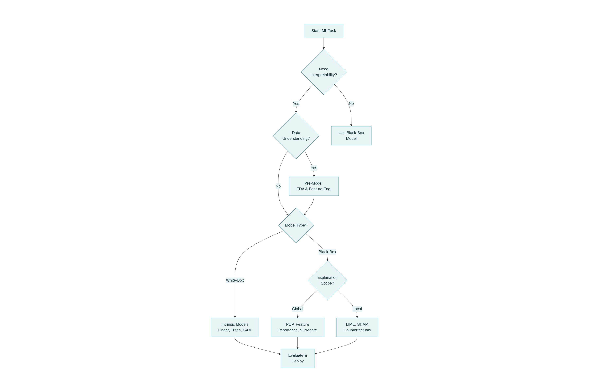

---

## Topic: Data Science Process and EDA
### Definition
Data science is iterative: collect, clean, understand, engineer features, model, evaluate, and repeat.

### Key Concepts
- CRISP-DM/KDD workflows are cyclic, not strictly linear.
- EDA is central to pre-model interpretability.
- EDA helps identify data quality issues, outliers, correlations, and potential bias.

### Exam Points
- Strong pre-model understanding improves both performance and explainability.

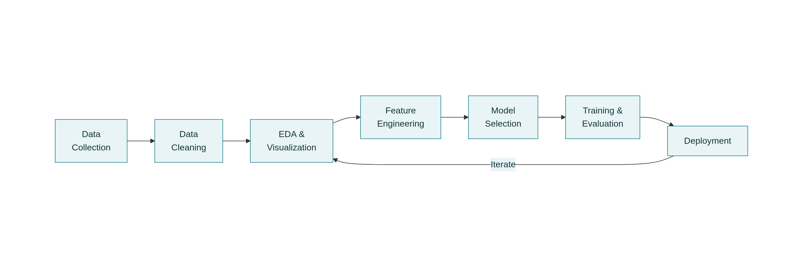

---

## Topic: Exploratory Data Analysis (EDA)
### Definition
EDA uses statistics and visual tools to understand data structure before modeling.

### Common Challenges
- High dimensionality
- Mixed data types
- Missing values and outliers
- Privacy constraints
- Very large data volume

### EDA Taxonomy
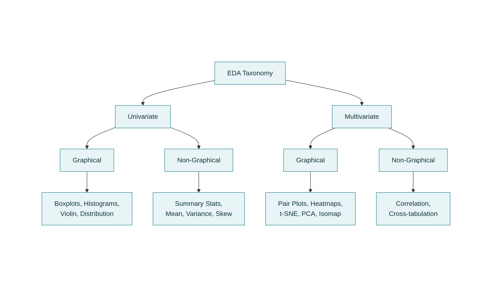

| | Graphical | Non-Graphical |
|---|---|---|
| **Univariate** | Histogram, Boxplot, Violin, Density | Mean, Variance, Skewness, Kurtosis |
| **Multivariate** | Pair plot, Heatmap, PCA/t-SNE/Isomap views | Correlation, Cross-tabulation |

### Role in Explainability
- Detect spread, skew, outliers, and missingness.
- Understand feature relationships before model fitting.
- Validate assumptions with domain experts.

### Key Formulas (Important)
**k-th Central Moment**:
\[
\mu_k = \frac{1}{N} \sum_{i=1}^{N}(x_i - \bar{x})^k
\]

**Variance**:
\[
\sigma^2 = \frac{1}{N} \sum_{i=1}^{N}(x_i - \bar{x})^2
\]

**Skewness**:
\[
\gamma = \frac{\mu_3}{\sigma^3}
\]

**Kurtosis**:
\[
\kappa = \frac{\mu_4}{\sigma^4}
\]

**Pearson Correlation**:
\[
\rho_p = \frac{Cov(X,Y)}{\sqrt{Var(X) \cdot Var(Y)}}
\]

**Spearman Rank Correlation**:
\[
\rho_s = 1 - \frac{\sum d_i^2}{n(n^2 - 1)}
\]

**Kernel Density Estimator**:
\[
\hat{f}_h(x) = \frac{1}{nh} \sum_{i=1}^{n} K\left(\frac{x - x_i}{h}\right)
\]

**Gaussian Kernel**:
\[
K(u) = \frac{1}{\sqrt{2\pi}} \exp\left(-\frac{u^2}{2}\right)
\]

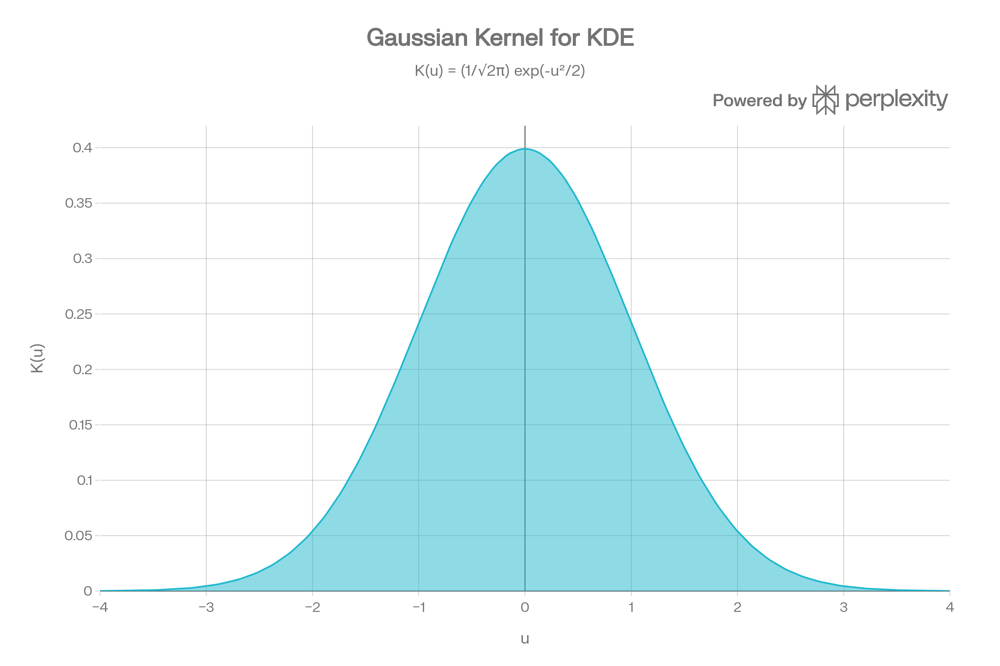

### Exam Points
- Zero correlation does not imply independence.
- Pearson is sensitive to outliers and nonlinearity; Spearman is rank-based and often more robust.
- In t-SNE, local grouping is usually more reliable than exact inter-cluster distance.

---

## Topic: Feature Engineering
### Definition
Feature engineering includes construction, selection, transformation, and dimensionality reduction of features.

### Why It Matters for Explainability
- Reduces complexity and noise.
- Improves interpretability and computational efficiency.
- Reduces overfitting by removing irrelevant or redundant features.

### Taxonomy

### Main Method Families
- **Filter-based**: rank features by statistical or information criteria.
- **Wrapper-based**: search subsets using model performance.
- **Unsupervised**: select or project features without labels.
- **Embedded**: selection integrated into model training.

### Important Methods and Formulas
**Laplacian Score**:
\[
score_{LS}(f_i)=\frac{\tilde{f}_i^T L \tilde{f}_i}{\tilde{f}_i^T D \tilde{f}_i}
\]
(smaller is better)

**Fisher Score**:
\[
score_{FS}(f_i)=\frac{f_i^T L_b f_i}{f_i^T L_w f_i}
\]
(larger is better)

**Information Gain / Mutual Information form**:
\[
I(X;Y)=H(X)+H(Y)-\sum P(x_i,y_j)\log\frac{P(x_i,y_j)}{P(x_i)P(y_j)}
\]

**ANOVA F-score**:
\[
score_F=\frac{SS_E/df_G}{SS_G/df_E}
\]

### Exam Points
- Search space for selecting from k features is \(2^k - 1\) subsets.
- L1 regularization (Lasso) can force coefficients to zero (feature selection).
- L2 regularization (Ridge) shrinks coefficients but usually keeps all features.
- Different methods can rank features differently; no single ranking is universally best.

---

## Quick Revision List
- Black-box issue and the need for XAI in high-stakes domains.
- Goals: understandability, comprehensibility, interpretability, transparency.
- Types of explanation: global, local, contrastive, what-if, counterfactual, example-based.
- XAI taxonomy: scope-based and stage-based (pre-model, intrinsic, post-hoc).
- EDA role, major plots/statistics, and core formulas.
- Feature selection families and key equations.

## Reference
1. Kamath, U., and Liu, J. *Explainable Artificial Intelligence: An Introduction to Interpretable Machine Learning*. Springer, 2021.
