# Unit-II: Model Visualization Techniques and Traditional Interpretable Algorithms

## 1) Model Validation, Evaluation, and Hyperparameters

### Core idea
Model validation checks whether a trained model generalizes to unseen data (not just training data). Hyperparameters are user-set values before training (for example: `max_depth`, `C`, `alpha`, learning rate), while model parameters are learned during training.

### Key points
- Split data into training, validation, and test sets.
- Use the same split across models for fair comparison.
- Overfitting: very good train performance, weak test performance (high variance).
- Underfitting: poor performance on both train and test (high bias).
- Bias-variance trade-off: increasing complexity lowers bias but can raise variance.
- `k`-fold cross-validation gives a robust estimate but costs more compute.

### Formula
\[
E_{cv} = \frac{1}{k}\sum_{i=1}^{k}E_i
\]
where `E_i` is fold `i` error.

### Important methods
- Holdout split: simple but noisier estimate.
- Grid Search: tries all parameter combinations.
- Random Search: samples combinations; often more efficient in large spaces.
- Bayesian optimization: guided search over hyperparameter space.

---

## 2) Model Selection and Learning/Validation Curves

### Core idea
Model selection chooses the model-hyperparameter pair with best validation behavior, not just best training score.

### Validation curve
Plots score vs one hyperparameter.
- Left side often underfits.
- Right side often overfits.
- Best point is where validation score peaks.

### Learning curve
Plots score vs training set size.
- Small gap + low scores -> underfitting.
- Large train-validation gap -> overfitting.
- If validation score keeps improving with more data, collecting data can help.

### Steps
1. Define hyperparameter range.
2. Train and compute cross-validated scores for each value.
3. Plot train vs validation curves.
4. Pick value near best validation score with stable generalization.

### Graphs
**Learning Curve:**
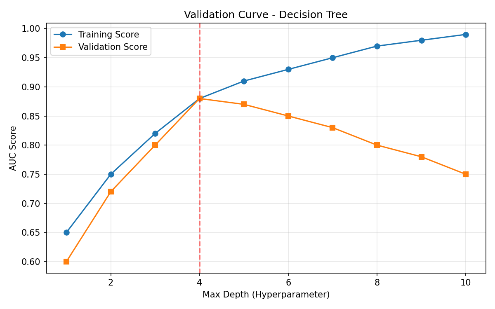

**Validation Curve:**
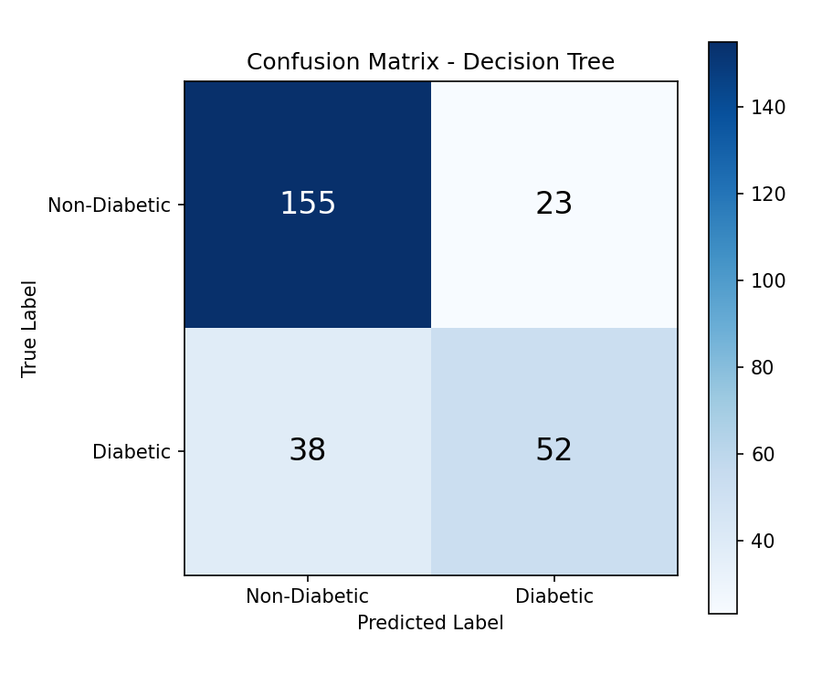

---

## 3) Classification Model Visualization

### Core idea
Visual diagnostics for classification include confusion matrix, ROC curve, precision-recall curve, and threshold tuning.

### Key metrics and formulas
| Metric | Formula |
|---|---|
| Precision | `TP / (TP + FP)` |
| Recall | `TP / (TP + FN)` |
| F1 Score | `2 * (Precision * Recall) / (Precision + Recall)` |
| Accuracy | `(TP + TN) / (TP + TN + FP + FN)` |
| Specificity | `TN / (TN + FP)` |

### Interpretation points
- ROC: plots TPR vs FPR over thresholds; AUC near 1 is better.
- PR curve: better than ROC for imbalanced classes.
- Threshold tuning changes FP/FN trade-off; `0.5` is not always best.

### Graphs
**Confusion Matrix:**
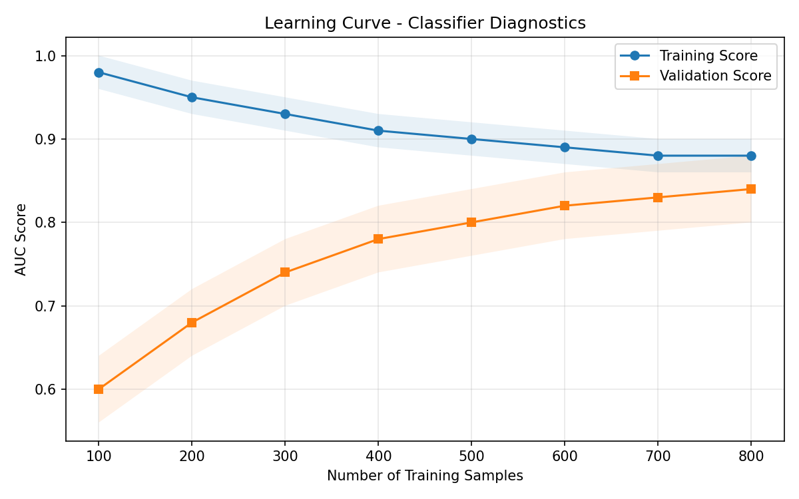

**ROC Curve:**
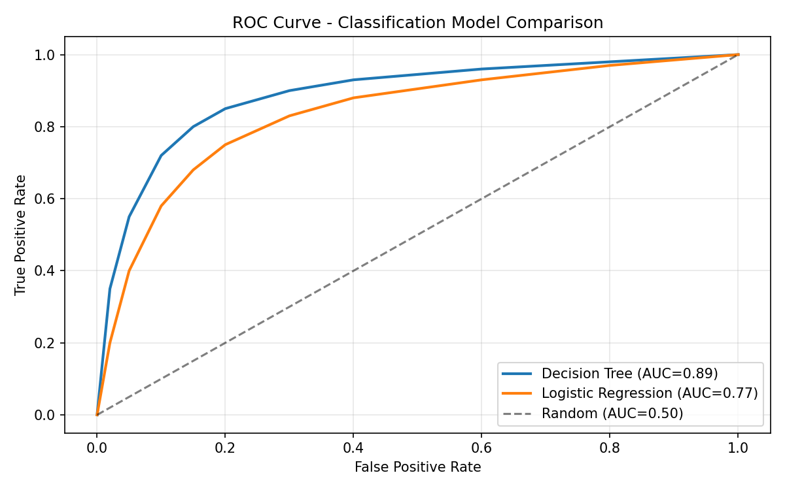

**Precision-Recall Curve:**

---

## 4) Regression Model Visualization

### Core idea
Regression diagnostics use residuals, prediction error plots, regularization tuning, and influence analysis.

### Key points
- Residual plot (residual vs predicted): should look random around zero.
- Prediction error plot (predicted vs actual): points near 45-degree line indicate better fit.
- Alpha selection: choose regularization strength using CV error curve.
- Cook's Distance: detects influential points.

### Formulas
Residual:
\[
e = y - \hat{y}
\]

Cook's Distance:
\[
D_i = \frac{\sum_{j=1}^{n}(\hat{y}_j - \hat{y}_{j(i)})^2}{p\cdot s^2}
\]
where `p` is number of parameters, `s^2` is MSE.

Heuristic threshold:
\[
D_i > \frac{4}{n}
\]

### Graphs
**Residual Plot:**
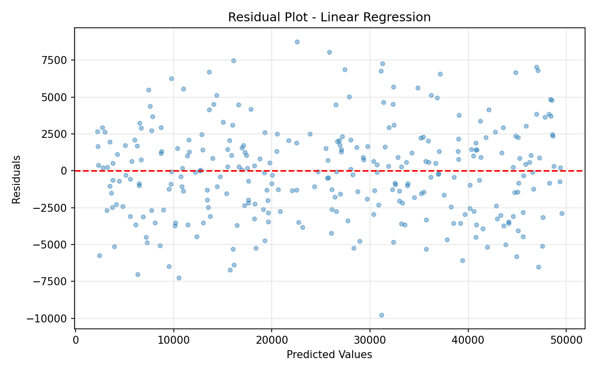

**Prediction Error Plot:**
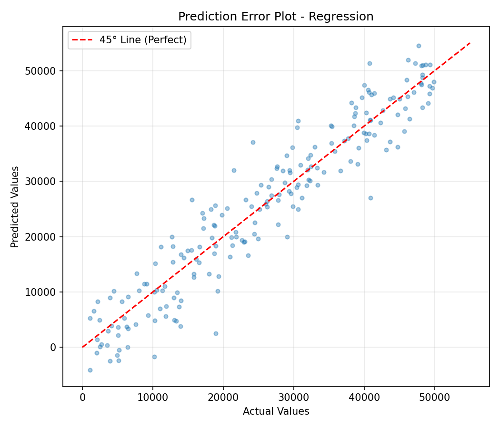

**Alpha Selection (Ridge):**
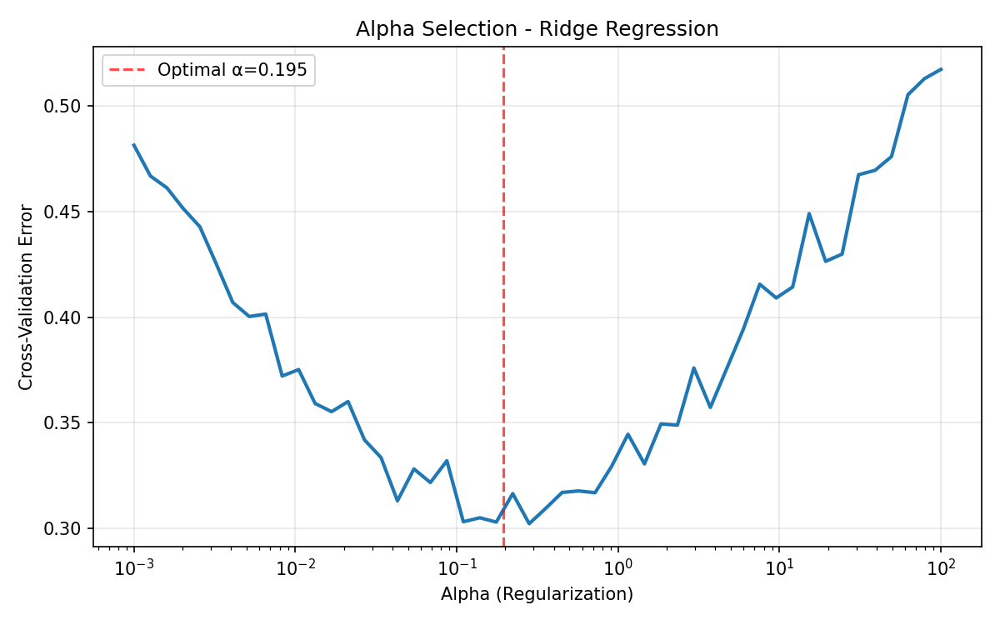

**Cook's Distance:**
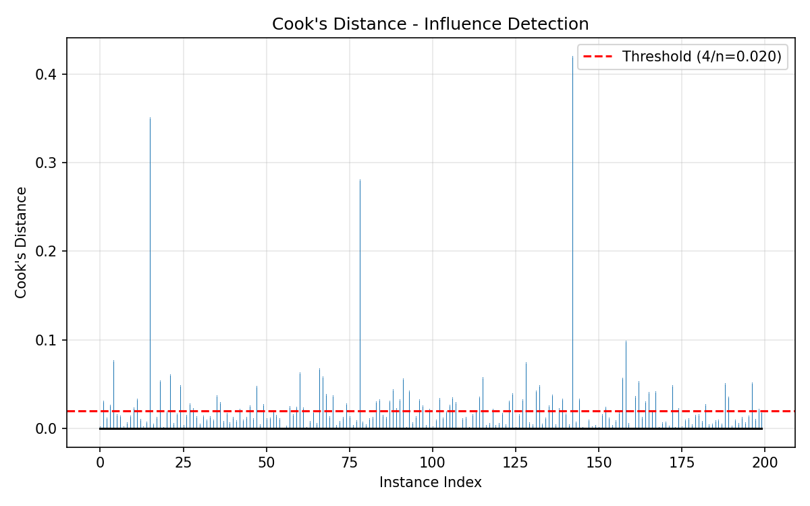

---

## 5) Clustering Model Visualization

### Core idea
Since clustering has no labels in many cases, we use internal quality measures and visual diagnostics.

### Methods
- Elbow method: choose `k` near major bend in distortion plot.
- Silhouette coefficient:
\[
s = \frac{b-a}{\max(a,b)}
\]
`a` = mean intra-cluster distance, `b` = mean nearest-cluster distance.

Interpretation:
- `s ~ 1`: compact, well-separated clusters.
- `s ~ 0`: overlapping clusters.
- `s < 0`: likely wrong assignment.

### Steps
1. Fit clustering for `k = 1..K`.
2. Plot distortion vs `k` and find elbow.
3. Validate with silhouette scores and distance maps.

### Graphs
**Elbow Method:**
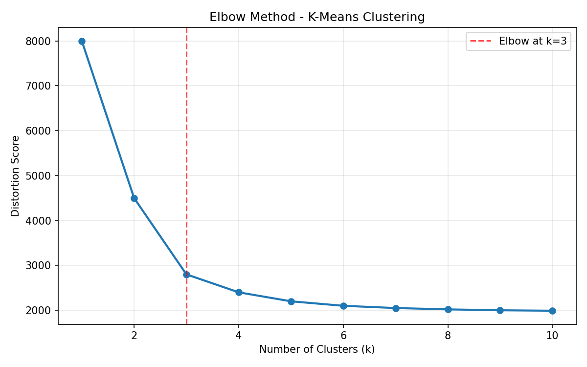

**Silhouette Scores:**
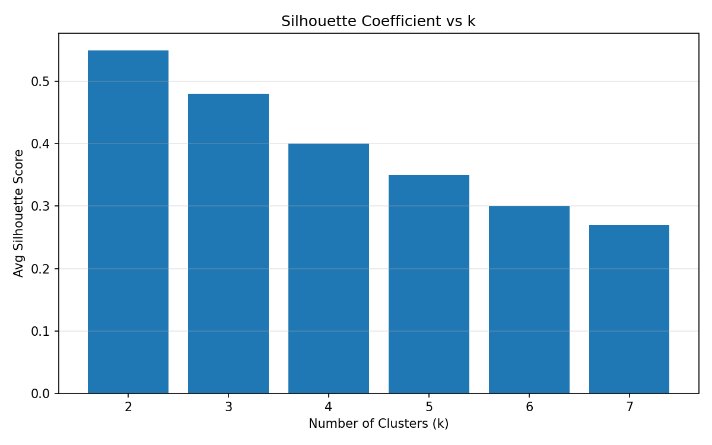

---

## 6) Interpretable ML Properties (Comparison Lens)

Use these properties to compare interpretable algorithms:
- Local vs Global explanation
- Linearity vs non-linearity
- Monotonicity
- Feature interactions
- Model complexity

Higher interaction capacity usually improves predictive power but reduces interpretability.

---

## 7) Traditional Interpretable Algorithms

## 7.1 Linear Regression
Model:
\[
y = w_0 + w_1x_1 + \cdots + w_dx_d
\]

Training error:
\[
E_{train}(w)=\frac{1}{N}\|Xw-y\|^2
\]

Normal equation:
\[
w_{opt}=(X^TX)^{-1}X^Ty
\]

Ridge:
\[
w_{opt}=(X^TX+\lambda I)^{-1}X^Ty
\]

Lasso:
\[
w_{opt}=\arg\min_w E_{train}(w)+\lambda\|w\|_1
\]

Elastic Net:
\[
w_{opt}=\arg\min_w E_{train}(w)+\lambda_1\|w\|_1+\lambda_2 w^Tw
\]

Assumptions: linearity, constant variance, low multicollinearity, near-normal residuals.

**Graph:**
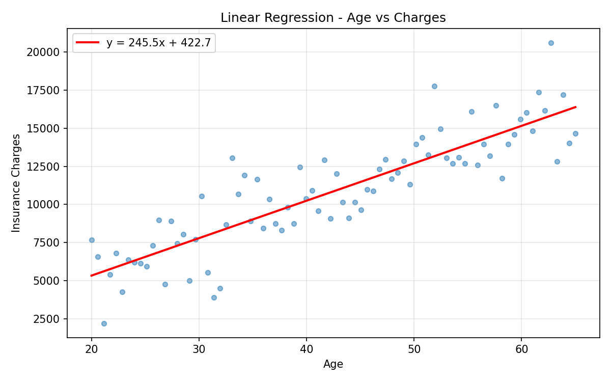

## 7.2 Logistic Regression
Hypothesis:
\[
P(y=1|x)=\sigma(w^Tx)=\frac{\exp(w^Tx)}{1+\exp(w^Tx)}
\]

Odds form:
\[
\frac{P(y=1|x)}{P(y=-1|x)}=\exp(w^Tx)
\]

Each unit increase in feature `x_i` multiplies odds by `\exp(w_i)`.

**Graph:**
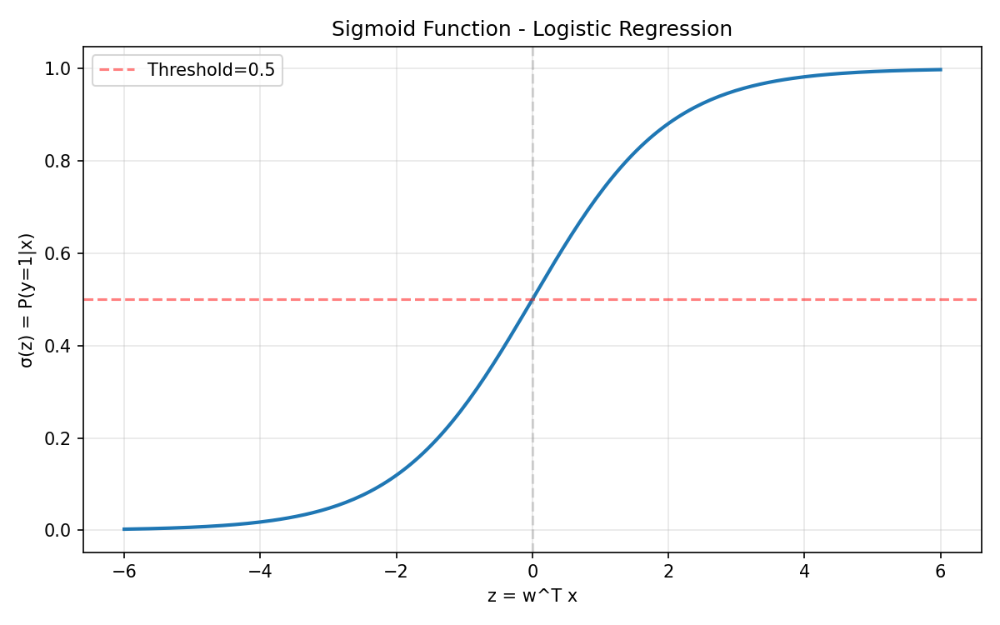

## 7.3 Generalized Linear Models (GLM)
General form:
\[
g(E(y|x))=w_0+w_1x_1+\cdots+w_dx_d
\]

Poisson (log link):
\[
E(y|x)=\exp(w_0+w_1x_1+\cdots+w_dx_d)
\]

Logistic regression is a binomial GLM with logit link.

## 7.4 Generalized Additive Models (GAM)
\[
g(E(y|x))=w_0+f_1(x_1)+f_2(x_2)+\cdots+f_d(x_d)
\]

Smoothing spline objective:
\[
\min \frac{1}{N}\sum_{i=1}^{N}(y_i-f(x_i))^2+\lambda\int (f''(x))^2\,dx
\]

GAM captures non-linear single-feature effects but usually not interactions (unless extended variants are used).

## 7.5 Naive Bayes
Decision rule:
\[
h(x)=\arg\max_{y\in\{0,1\}}P(Y=y)\prod_{j=1}^{d}P(X_j=x_j|Y=y)
\]

Gaussian conditional:
\[
P(X=x|Y=y)=\frac{1}{\sqrt{2\pi\sigma_k^2}}\exp\left(-\frac{(x-\mu_k)^2}{\sigma_k^2}\right)
\]

Very fast and simple; main limitation is feature-independence assumption.

## 7.6 Bayesian Networks
DAG-based probabilistic model with conditional dependencies.
Counterfactual influence check:
\[
\max_{A,A'}\left|P(Y|X_1,\dots,X_n,A)-P(Y|X_1,\dots,X_n,A')\right|
\]

Supports local and global reasoning; structure learning can be expensive.

## 7.7 Decision Trees (CART)
Gini impurity:
\[
\text{Gini}=1-\sum_j p_j^2
\]

Entropy:
\[
H=-\sum_j p_j\log_2(p_j)
\]

Interpretable rule paths, handles interactions/non-linearity, but can overfit without pruning.

**Graph:**
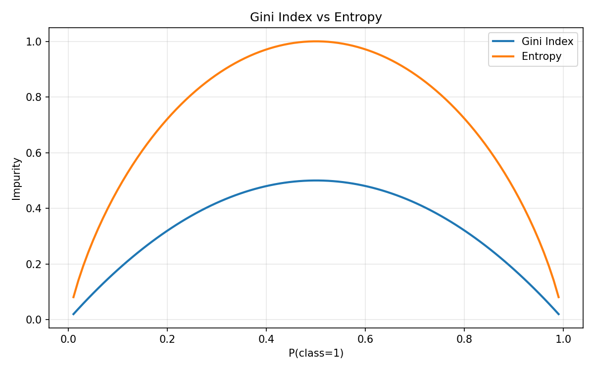

## 7.8 Rule Induction (CN2)
Separate-and-conquer strategy:
1. Learn one high-quality rule.
2. Remove covered instances.
3. Repeat until positives are covered.
4. Prune to control overfitting.

Good interpretability via explicit IF-THEN rules; rule ordering affects prediction.

---

## 8) Quick Comparison Table

| Algorithm | Scope | Linearity | Monotonicity | Feature Interactions | Complexity |
|---|---|---|---|---|---|
| Linear Regression | Global | Linear | Yes | No | Low |
| Logistic Regression | Global | Linear | Yes | No | Low |
| GLM | Global | Linear (in link space) | Yes | No | Low-Medium |
| GAM | Global | Non-linear (additive) | Usually yes | Limited | Low-Medium |
| Naive Bayes | Global + Local | Usually linear boundary (variant-dependent) | Usually yes | No | Low |
| Bayesian Network | Global + Local | Non-linear | Not guaranteed | Yes | Medium |
| Decision Tree (CART) | Global | Non-linear | Partial | Yes | Medium-High |
| Rule Induction (CN2) | Global + Local | Non-linear | Partial | Yes | Medium-High |
