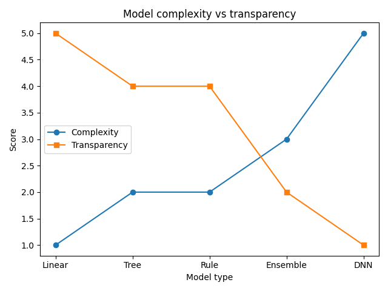
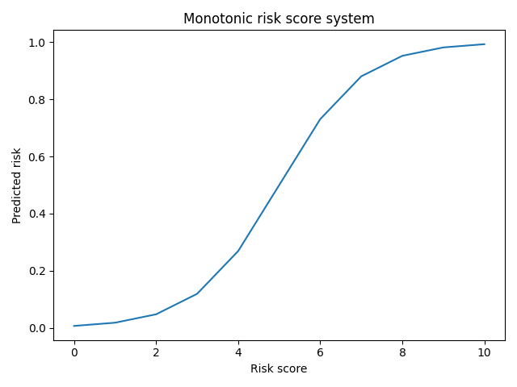
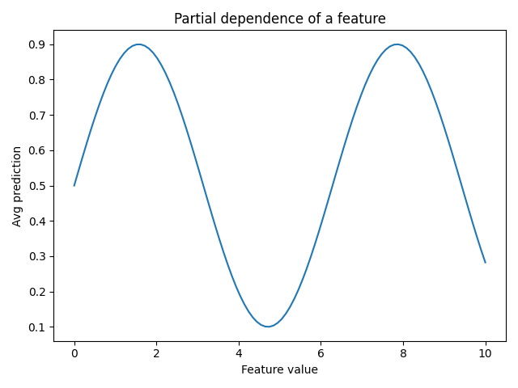

# Unit III: Model Interpretability and Post-Hoc Explanations

## 1) Interpretable vs Explainable

### Definition
- **Interpretable model**: model internals are directly understandable (weights, rule paths, short trees).
- **Explainable model**: model may be black-box, but we attach external explanation methods.
- **XAI** studies both intrinsic interpretability and post-hoc explanation.

### Key Concepts
- Interpretable models support direct human simulation and audit.
- Explainable models use surrogates, attributions, examples, and visual tools.
- In high-stakes settings, interpretable models are usually preferred where possible.
- Accuracy vs interpretability is not always a strict trade-off, especially on tabular data.
- Explanations can be **global** (overall behavior) or **local** (single prediction).

### Key Formula / Steps
Surrogate-based explanation setup:
\[
\min_g \sum_i \ell(f(x_i), g(x_i)) + \Omega(g)
\]
where:
- `f` is black-box model,
- `g` is interpretable surrogate,
- first term is fidelity,
- `\Omega(g)` penalizes complexity.

### Exam Points
- Examples of intrinsic interpretability: linear/logistic models, GAMs, small trees, rule lists.
- Post-hoc explanations may be useful but can be unfaithful to true model logic.
- In regulation-heavy domains (finance, healthcare), justification quality matters.

### Graph

### Source
- Explainable AI lecture notes + Interpretable ML reference text.

---

## 2) Algorithms, Tools and Libraries

### Definition
- **Algorithms**: concrete XAI methods (EBM, SHAP, LIME, counterfactuals, rule methods).
- **Tools/Libraries**: software implementations and workflows for these methods.

### Key Concepts
- Interpretable algorithms: EBM/GA2M, optimal trees, rule lists, scoring systems.
- Post-hoc algorithms: PDP, ICE, ALE, LIME, SHAP, Anchors, counterfactual methods.
- Deep-model explanation includes Grad-CAM, Integrated Gradients, LRP, DeepLIFT.
- Modern libraries cover tabular, text, image, and time-series use cases.

### Key Formula / Steps
Shapley value for feature `i`:
\[
\phi_i = \sum_{S\subseteq F\setminus\{i\}} \frac{|S|!(|F|-|S|-1)!}{|F|!}\big(f(S\cup\{i\})-f(S)\big)
\]
Interpretation: average marginal contribution across all coalitions.

### Exam Points
- Common toolkits: AIX360, SHAP, LIME, Captum, tf-keras-vis.
- Toolkit selection depends on model family, data modality, and user question.
- Always discuss trade-offs: faithfulness, stability, and compute cost.

### Graph
- Use model-family comparison or method-mapping diagram if asked.

### Source
- Intro XAI textbook chapters + practical tutorial slides.

---

## 3) Ensemble-Based Interpretable Models

### Definition
- Ensembles combine weak learners for better predictive performance.
- Interpretable ensembles constrain form to preserve explainability.

### Key Concepts
- **Boosted rulesets**: weighted combination of decision rules.
- **EBM / GA2M**: additive shape functions (main + selected pairwise interactions).
- **RuleFit**: sparse linear model over extracted rules plus original features.
- **Skope-Rules**: selects high-precision, high-recall rules from forests.
- **iRF**: discovers stable high-order interactions.

### Key Formula / Steps
EBM model:
\[
f(x) = \beta_0 + \sum_j f_j(x_j) + \sum_{(j,k)} f_{jk}(x_j,x_k)
\]
- `f_j` are learned 1D shape functions,
- `f_jk` are selected 2D interaction terms.

### Exam Points
- EBM gives global interpretability through per-feature contribution curves.
- Rule-based ensembles offer readable logic but may still be longer than single-tree explanations.
- Compared with black-box ensembles, these are easier to justify in decision support.

### Graph
- Feature contribution curves (PDP-like) and interaction heatmaps.

### Source
- Interpretable ML chapter on ensemble-based methods.

---

## 4) Decision Tree-Based Interpretable Models

### Definition
- Trees split feature space hierarchically; each root-to-leaf path is a rule.
- Optimal trees use global optimization rather than only greedy splitting.

### Key Concepts
- **CART** uses greedy impurity reduction (Gini/entropy).
- **OCT** (Optimal Classification Trees) solves a regularized global objective.
- **ODT** extends to decision/regression settings with global constraints.
- Constraints often include max depth, sparsity, fairness, monotonicity.

### Key Formula / Steps
Gini impurity:
\[
\text{Gini} = 1 - \sum_c p_c^2
\]

OCT-style objective:
\[
\min_T \sum_i \ell(y_i, T(x_i)) + \lambda\cdot\text{size}(T)
\]

### Exam Points
- Trees are intuitive and easy to convert into IF-THEN rules.
- Small trees are interpretable; deeper trees reduce readability.
- Global optimization improves compact-tree quality but is computationally harder.

### Graph
- Typical diagram: tree depth vs error/complexity.

### Source
- Decision-tree interpretability and optimal tree optimization references.

---

## 5) Rule-Based Interpretable Techniques

### Definition
- Rule models predict using human-readable conditions.
- Forms: unordered rule sets or ordered decision lists.

### Key Concepts
- **BOA** (Bayesian Ors of Ands): prior favors fewer, shorter rules.
- **CORELS**: certifiably optimal rule lists (branch-and-bound).
- **BRL**: Bayesian posterior over ordered rule lists.
- **BCM** links rule-like reasoning with prototype-based generative structure.

### Key Formula / Steps
Decision-list inference (generic):
- evaluate `r_1, r_2, ..., r_K` in order,
- return first matched rule label,
- otherwise apply default rule.

Bayesian rule posterior:
\[
p(R\mid D) \propto p(D\mid R)p(R)
\]

### Exam Points
- Rule lists are highly communicable in policy and clinical settings.
- Bayesian priors control complexity and help avoid overfitting.
- CORELS provides optimality certificates, a major practical advantage.

### Graph
- Rule support/confidence comparison bars (if available).

### Source
- Rule-based techniques chapter in interpretable ML text.

---

## 6) Scoring System Models

### Definition
- Scoring systems produce integer points and convert score to risk class/probability.
- Classic example: **SLIM** (Supersparse Linear Integer Models).

### Key Concepts
- Coefficients are small integers and mostly sparse.
- Designed for manual reasoning (clinical/credit scorecards).
- Often enforce monotonicity on medically or operationally meaningful variables.
- Penalties control both sparsity and coefficient size.

### Key Formula / Steps
Linear score:
\[
s(x) = \sum_j w_j x_j + b
\]
with integer or near-integer `w_j`.

Optimization idea:
- minimize classification error,
- plus sparsity (`\ell_0`) and magnitude (`\ell_1`) penalties.

Threshold decision:
- if `s \ge \tau` then classify as high-risk (or positive).

### Exam Points
- Very practical in medicine and risk management due to transparency.
- Slight accuracy drop vs complex models may be acceptable for accountability.
- Easy to communicate in viva and case-study answers.

### Graph

### Source
- Scoring-system / SLIM chapter references.

---

## 7) Post-Hoc Tools and Libraries

### Definition
- Post-hoc tools explain trained models without modifying model internals.
- Libraries combine visual, attribution, and example-based explainers.

### Key Concepts
- **AIX360**: broad collection (LIME/SHAP wrappers, CFs, prototypes, diagnostics).
- **Captum (PyTorch)**: IG, DeepLIFT, Grad-CAM, LRP, Occlusion.
- **tf-keras-vis**: saliency and Grad-CAM for Keras/TensorFlow.
- SHAP/LIME packages are commonly used for tabular/text/image tasks.
- Many tools support local+global explanations and quality checks.

### Key Formula / Steps
Typical pipeline:
1. train model,
2. call explainer API: `explain(model, data, target)`,
3. inspect attributions, plots, and examples,
4. validate with sanity checks (stability/faithfulness).

### Exam Points
- Tool choice is question-driven ("why this prediction?" vs "what drives model globally?").
- Post-hoc workflows improve auditability and reproducibility.
- Always mention failure modes: instability and potential unfaithfulness.

### Graph
- Architecture view: model -> explainer -> visualization.

### Source
- XAI toolkit tutorials and AIX360 overview materials.

---

## 8) Visual Explanation Methods

### Definition
- Visual methods show how feature values affect predictions.
- They provide intuitive global and local insight.

### Key Concepts
- **PDP**: average effect of one feature.
- **ICE**: per-instance effect curves.
- **Ceteris Paribus**: local profile for one case.
- **ALE**: robust alternative under correlated features.
- **Breakdown / Interaction Breakdown**: additive contribution decomposition.

### Key Formula / Steps
PDP for feature `j`:
\[
\hat{f}_j(x_j)=\frac{1}{n}\sum_i f(x_j, x_{i,-j})
\]

ALE idea:
- estimate local changes in prediction over bins,
- accumulate these local effects to reduce correlation bias.

### Exam Points
- PDP/ICE can mislead under strong feature correlation.
- ALE is often preferred when correlated predictors exist.
- Breakdown methods are cheaper approximations to Shapley-style decomposition.

### Graph

### Source
- Visual explanation chapters and PDP/ICE lecture slides.

---

## 9) Feature Importance Methods

### Definition
- Importance methods rank feature contribution to model behavior.
- They may be global (dataset-level) or local (instance-level).

### Key Concepts
- **Permutation Importance**: performance drop after shuffling feature.
- **LOCO / ablation**: remove one covariate and assess impact.
- **SHAP / Shapley**: game-theoretic attribution.
- **KernelSHAP**: model-agnostic approximation.
- **Anchors**: high-precision local IF-THEN explanations.
- **Global surrogate**: interpretable model that mimics black-box outputs.
- **LIME**: sparse local linear surrogate with distance weighting.

### Key Formula / Steps
Permutation importance:
\[
\Delta_j = \text{Perf}(D)-\text{Perf}(D_{\pi(j)})
\]

LIME objective (local surrogate):
\[
\min_g \; L(f,g,\pi_x)+\Omega(g)
\]

### Exam Points
- Shapley has key axiomatic guarantees (efficiency, symmetry, dummy, additivity).
- Permutation is simple and strong globally but can be unstable with correlated features.
- Anchors improve human readability for local decisions.

### Graph
- Common plot: mean absolute SHAP bar chart.

### Source
- Feature importance chapter + SHAP/LIME teaching slides.

---

## 10) Example-Based Explanations

### Definition
- Explain predictions using representative, contrastive, or influential examples.
- These methods are often intuitive for non-technical users.

### Key Concepts
- **Contrastive**: "Why class `y` instead of `y'`?"
- **kNN evidence**: show nearest similar cases.
- **Trust score**: compares distance to class manifolds.
- **Counterfactuals**: minimal actionable changes to flip model output.
- **Prototypes/Criticisms**: typical vs atypical class examples.
- **Influential instances**: points that strongly affect fit/predictions.

### Key Formula / Steps
Counterfactual optimization:
\[
\min_{x'} d(x,x') \quad \text{s.t.} \quad f(x')=y'\;\text{and feasibility constraints}
\]

Influence-style quantity:
\[
D_i = \sum_j (y_j - y_{j(i)})^2
\]

### Exam Points
- Useful for trust calibration, debugging, and recourse.
- Counterfactuals must satisfy plausibility/actionability constraints.
- Prototype/criticism summaries give global dataset understanding.

### Graph
- Typical scatter with influential points near boundary.

### Source
- Example-based explanation chapter + counterfactual tutorial material.

---

## 11) Rapid Revision Table

| Topic | Main Strength | Main Limitation | Best Use Case |
|---|---|---|---|
| Interpretable vs Explainable | Clear framework for method choice | Confusion between fidelity and readability | Intro/definition questions |
| Ensemble Interpretable Models | Better accuracy with some transparency | More complex than single rule/tree | Tabular predictive tasks |
| Optimal Trees / Rule Lists | Human-readable decisions | Optimization can be expensive | High-stakes policy rules |
| Scoring Systems (SLIM) | Manual, auditable, sparse | May underfit complex interactions | Clinical and credit scoring |
| PDP/ICE/ALE | Strong visual intuition | PDP/ICE bias under correlation | Model diagnostics |
| SHAP/LIME/Anchors | Rich local/global explanations | Stability and faithfulness concerns | Post-hoc analysis |
| Counterfactual/Prototype | Actionable and intuitive | Feasibility constraints needed | User-facing explanation |

---

## 12) Exam Answer Template (5-8 Marks)

1. Define method class (interpretable or post-hoc).
2. State whether explanation is local/global.
3. Write one core formula.
4. Give one practical example.
5. Mention one limitation and one safer alternative.

This structure gives complete, balanced answers and avoids over-verbose repetition.
